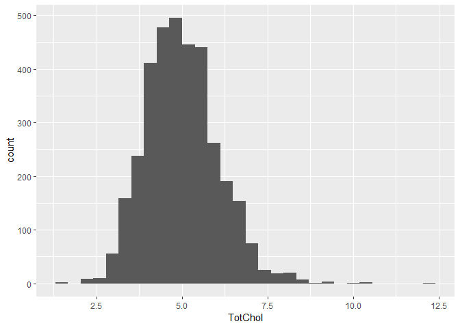
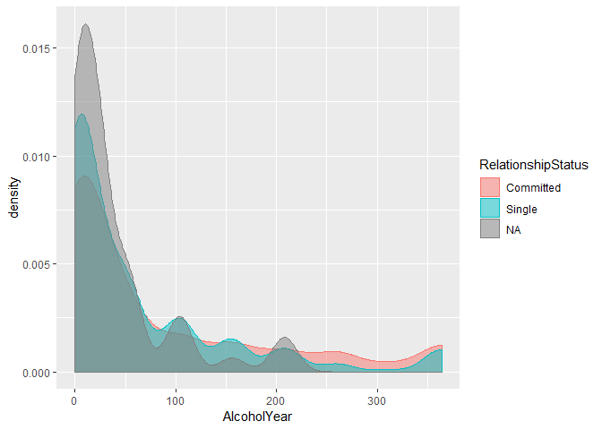
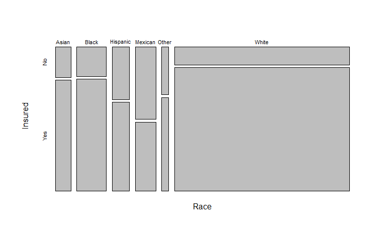

**Intro Slides (UP TO SLIDE 5)**
packages needed today are readr, dplyr, ggplot2, broom

## Load tidyverse and broom packages

```r
library(tidyverse)
```

```
## Warning: package 'tidyverse' was built under R version 3.5.2
```

```
## -- Attaching packages ---------------------------------- tidyverse 1.2.1 --
```

```
## v ggplot2 3.1.0     v purrr   0.2.5
## v tibble  1.4.2     v dplyr   0.7.8
## v tidyr   0.8.1     v stringr 1.3.1
## v readr   1.1.1     v forcats 0.3.0
```

```
## Warning: package 'ggplot2' was built under R version 3.5.2
```

```
## Warning: package 'dplyr' was built under R version 3.5.2
```

```
## -- Conflicts ------------------------------------- tidyverse_conflicts() --
## x dplyr::filter() masks stats::filter()
## x dplyr::lag()    masks stats::lag()
```

```r
library(broom)
```

## Create new project with NHANES data

### About NHANES

The data we're going to work with comes from the National Health and Nutrition Examination Survey (NHANES) program at the CDC. You can read a lot more about NHANES on the [CDC's website](http://www.cdc.gov/nchs/nhanes/) or [Wikipedia](https://en.wikipedia.org/wiki/National_Health_and_Nutrition_Examination_Survey). 

NHANES is a research program designed to assess the health and nutritional status of adults and children in the United States. The survey is one of the only to combine both survey questions and physical examinations. It began in the 1960s and since 1999 examines a nationally representative sample of about 5,000 people each year. The NHANES interview includes demographic, socioeconomic, dietary, and health-related questions. The physical exam includes medical, dental, and physiological measurements, as well as several standard laboratory tests. NHANES is used to determine the prevalence of major diseases and risk factors for those diseases. NHANES data are also the basis for national standards for measurements like height, weight, and blood pressure. Data from this survey is used in epidemiology studies and health sciences research, which help develop public health policy, direct and design health programs and services, and expand the health knowledge for the Nation.

We are using a small slice of this data. We're only using a handful of variables from the 2011-2012 survey years on about 5,000 individuals. The CDC uses a [sampling strategy](http://www.cdc.gov/nchs/data/series/sr_02/sr02_162.pdf) to purposefully oversample certain subpopulations like racial minorities. Naive analysis of the original NHANES data can lead to mistaken conclusions because the percentages of people from each racial group in the data are different from general population. The 5,000 individuals here are resampled from the larger NHANES study population to undo these oversampling effects, so you can treat this as if it were a simple random sample from the American population.

You can download the data from Collab. The file is called **nhanes.csv**. There's also a data description (filename **nhanes_dd.csv**) that lists and describes each variable in our NHANES dataset.

### Import & inspect

First, let's load the tidyverse library.


```r
library(tidyverse)
```

If you see a warning that looks like this: `Error in library(tidyverse) : there is no package called 'tidyverse'`, then you don't have the package installed correctly.

Now, let's actually load the data and take a look.


```r
nh <- read_csv("nhanes.csv")
```

```
## Parsed with column specification:
## cols(
##   .default = col_integer(),
##   Gender = col_character(),
##   Race = col_character(),
##   Education = col_character(),
##   MaritalStatus = col_character(),
##   RelationshipStatus = col_character(),
##   Insured = col_character(),
##   Poverty = col_double(),
##   HomeOwn = col_character(),
##   Work = col_character(),
##   Weight = col_double(),
##   Height = col_double(),
##   BMI = col_double(),
##   Testosterone = col_double(),
##   HDLChol = col_double(),
##   TotChol = col_double(),
##   Diabetes = col_character(),
##   PhysActive = col_character(),
##   SmokingStatus = col_character()
## )
```

```
## See spec(...) for full column specifications.
```

```r
nh
```

```
## # A tibble: 5,000 x 32
##       id Gender   Age Race  Education MaritalStatus RelationshipSta~
##    <int> <chr>  <int> <chr> <chr>     <chr>         <chr>           
##  1 62163 male      14 Asian <NA>      <NA>          <NA>            
##  2 62172 female    43 Black High Sch~ NeverMarried  Single          
##  3 62174 male      80 White College ~ Married       Committed       
##  4 62174 male      80 White College ~ Married       Committed       
##  5 62175 male       5 White <NA>      <NA>          <NA>            
##  6 62176 female    34 White College ~ Married       Committed       
##  7 62178 male      80 White High Sch~ Widowed       Single          
##  8 62180 male      35 White College ~ Married       Committed       
##  9 62186 female    17 Black <NA>      <NA>          <NA>            
## 10 62190 female    15 Mexi~ <NA>      <NA>          <NA>            
## # ... with 4,990 more rows, and 25 more variables: Insured <chr>,
## #   Income <int>, Poverty <dbl>, HomeRooms <int>, HomeOwn <chr>,
## #   Work <chr>, Weight <dbl>, Height <dbl>, BMI <dbl>, Pulse <int>,
## #   BPSys <int>, BPDia <int>, Testosterone <dbl>, HDLChol <dbl>,
## #   TotChol <dbl>, Diabetes <chr>, DiabetesAge <int>, nPregnancies <int>,
## #   nBabies <int>, SleepHrsNight <int>, PhysActive <chr>,
## #   PhysActiveDays <int>, AlcoholDay <int>, AlcoholYear <int>,
## #   SmokingStatus <chr>
```

> _**A note on characters versus factors:**_ One thing that you immediately notice is that all the categorical variables are read in as _character_ data types. This data type is used for storing strings of text, for example, IDs, names, descriptive text, etc. There's another related data type called _**factors**_. Factor variables are used to represent categorical variables with two or more _levels_, e.g., "male" or "female" for Gender, or "Single" versus "Committed" for RelationshipStatus. For the most part, statistical analysis treats these two data types the same. It's often easier to leave categorical variables as characters. However, in some cases you may get a warning message alerting you that a character variable was converted into a factor variable during analysis. Generally, these warnings are nothing to worry about.

Let's convert character variables to factor variables using dplyr's `mutate_if`:


```r
class(nh$Race)
levels(nh$Race)

nh <- nh %>% mutate_if(is.character, as.factor)
nh
class(nh$Race)
levels(nh$Race)
```

If you want to see the whole dataset, there are two ways to do this. First, you can click on the name of the data.frame in the **Environment** panel in RStudio. Or you could use the `View()` function (_with a capital V_).


```r
View(nh)
```

Recall several built-in functions that are useful for working with data frames.

- Content:
    - `head()`: shows the first few rows
    - `tail()`: shows the last few rows
- Size:
    - `dim()`: returns a 2-element vector with the number of rows in the first element, and the number of columns as the second element (the dimensions of the object)
    - `nrow()`: returns the number of rows
    - `ncol()`: returns the number of columns
- Summary:
    - `colnames()` (or just `names()`): returns the column names
    - `glimpse()` (from **dplyr**): Returns a glimpse of your data, telling you the structure of the dataset and information about the class, length and content of each column


```r
head(nh)
tail(nh)
dim(nh)
names(nh)
glimpse(nh) #variable view
```


## Descriptive statistics

We can access individual variables within a data frame using the `$` operator, e.g., `mydataframe$specificVariable`. Let's print out all the **`Race`** values in the data. Let's then see what are the `unique` values of each.


```r
# Display all Race values
nh$Race

# Get the unique values of Race
levels(nh$Race)
unique(nh$Race)
length(unique(nh$Race))

# Do the same thing the dplyr way
nh$Race %>% unique()
nh$Race %>% unique() %>% length()

#create a table of frequencies
table(nh$Race)

#2-factor table or cross tabulation
table(nh$Race, nh$Gender)
```

Now let's calculate some descriptive stats for the **`Age`** variable.

```r
# Age mean, median, range
mean(nh$Age)
```

```
## [1] 36.708
```

```r
median(nh$Age)
```

```
## [1] 36
```

```r
range(nh$Age)
```

```
## [1]  0 80
```

```r
sd(nh$Age)
```

```
## [1] 22.56179
```

```r
summary(nh$Age)
```

```
##    Min. 1st Qu.  Median    Mean 3rd Qu.    Max. 
##    0.00   17.00   36.00   36.71   54.00   80.00
```

You could also do the last few operations using dplyr, but remember, this returns a single-row, single-column tibble, _not_ a single scalar value like the above. This is only really useful in the context of grouping and summarizing. 


```r
# Compute the mean age
nh %>% 
  summarize(mean(Age))

# Now grouped by other variables
nh %>% 
  group_by(Gender, Race) %>% 
  summarize(mean(Age))
```

The `summary()` function (note, this is different from **dplyr**'s `summarize()`) works differently depending on which kind of object you pass to it. If you run `summary()` on a data frame, you get some very basic summary statistics on each variable in the data.


```r
summary(nh)
#point out missings
```


### Missing data

Let's try taking the mean of a different variable, either the dplyr way or the simpler `$` way.


```r
# the dplyr way: returns a single-row single-column tibble/dataframe
nh %>% summarize(mean(Income))

# returns a single value
mean(nh$Income)
```

What happened there? `NA` indicates _missing data_. Take a look at the Income variable.


```r
# Look at just the Income variable
nh$Income

# Or view the dataset
# View(nh)
```

Notice that there are lots of missing values for Income. Trying to get the mean a bunch of observations with some missing data returns a missing value by default. This is almost universally the case with all summary statistics -- a single `NA` will cause the summary to return `NA`. Now look at the help for `?mean`. Notice the `na.rm` argument. This is a logical (i.e., `TRUE` or `FALSE`) value indicating whether or not missing values should be removed prior to computing the mean. By default, it's set to `FALSE`. Now try it again.


```r
?mean
```

```
## starting httpd help server ... done
```

```r
mean(nh$Income, na.rm=TRUE)
```

```
## [1] 57077.66
```

The `is.na()` function tells you if a value is missing. Get the `sum()` of that vector, which adds up all the `TRUE`s to tell you how many of the values are missing. 


```r
is.na(nh$Income)
sum(is.na(nh$Income))
sum(is.na(nh$Income)) / length(nh$Income)
```

### EDA
Now, let's talk about exploratory data analysis (EDA).

It's always worth examining your data visually before you start any statistical analysis or hypothesis testing. We already spent an entire day on **[exploratory data analysis](https://en.wikipedia.org/wiki/Exploratory_data_analysis)** in the **data visualization lesson**. We'll only mention a few of the big ones here: **histograms** and **scatterplots**. We will also cover **density plots** when we go through some stats in a few minutes.

#### Histograms

We can learn a lot from the data just looking at the value distributions of particular variables. Let's make some histograms with ggplot2. 

Looking at BMI shows a few extreme outliers. 


What about weight?

Looking at weight initially shows us that the units are probably in kg. Replotting that with more bins shows a clear bimodal distribution. Are there kids in this data? The age distribution shows us the answer is _yes_.

```r
ggplot(nh, aes(Weight)) + geom_histogram(bins=30) 
```

```
## Warning: Removed 31 rows containing non-finite values (stat_bin).
```

<!-- -->

```r
# More bins
ggplot(nh, aes(Weight)) + geom_histogram(bins=80) #clearly bimodal...bc of kids
```

```
## Warning: Removed 31 rows containing non-finite values (stat_bin).
```

<!-- -->

```r
ggplot(nh, aes(Age)) + geom_histogram(bins=30)
```

<!-- -->

#### Scatterplots
Let's look at how a few different variables relate to each other. E.g., height and weight:

```r
ggplot(nh, aes(Height, Weight, col=Gender)) + geom_point()
```

```
## Warning: Removed 166 rows containing missing values (geom_point).
```

<!-- -->

Revisit the **data visualization lesson** for much more on EDA.

Let's create a new dataset from `nh` called `nha` that only has adults to use for the rest of class. To prevent us from making any mistakes downstream, let's remove the `nh` object.


```r
nha <- filter(nh, Age>=18)
rm(nh)
# View(nha)
```


### Exercise 1

1. Using the adults data set you just created (`nha`), what is the mean 60-second pulse rate for all participants in the data?

```
## [1] 72.62109
```

```
## [1] 72.62109
```

2. With the `nha` dataset, what's the range of values for diastolic blood pressure in all participants? (Hint: see help for `min()`, `max()`, and `range()` functions, e.g., enter `?range` to get help).

```
## [1]   0 116
```

3. What's the variance and standard deviation for income among the adult participants?

```
## [1] 1118963622
```

```
## [1] 33450.91
```

4. Create a histogram of TotChol (Total Cholesterol).

```
## `stat_bin()` using `bins = 30`. Pick better value with `binwidth`.
```

```
## Warning: Removed 207 rows containing non-finite values (stat_bin).
```

<!-- -->

## Stats with Continuous variables
Slides 6 & 7

### T-tests

Let's do a few two-sample t-tests to test for _differences in means between two groups_. The function for a t-test is `t.test()`. See the help for `?t.test`.

1. Are there differences in height for males versus females in this dataset?

To assess this question, first we make sure that a t-test is the correct type of analysis. A t-test tests the difference in 2 means - yes that is what we want to do. Next we need to decide what type of t-test we need to perform by thinking through the assumptions. Domain specific knowledge and exploratory data analyses will help here.

Random sampling -- YES

Independent samples -- YES (men and women are different people - unrelated). Would be paired t-test if we were assessing height of husband-wife pairs or brother-sister pairs

Normality -- ?? well, we need to assess this. We'll discuss this in a few minutes.

Equal variance. Also called homoscedasticity of variances.
?? we could think about the populations of men and women and what we know about height and conclude reasonably that the variance is equal for height


```r
#EDA
# I like density plots colored by group. Helps you see distribution of variable to assess equal variance. Also helps you see if there is a noticeable difference in groups.
ggplot(nha, aes(Height, color = Gender, fill = Gender)) + geom_density(alpha = 0.5)
```

```
## Warning: Removed 26 rows containing non-finite values (stat_density).
```

<!-- -->

```r
#looks like there is a significant difference between the populations.
#looks like we are safe to assume equal variance
```

The last assumption we need to talk about here is normality. Normality can be assessed graphically or via hypothesis tests. There are pros and cons to either approach. 

Graphically, we could look at a histogram, boxplot, or a more specialized plot to assess normality called a QQ plot (quantile-quantile plot or quantile comparison plot or normal probability plot). A QQ plot graphs the expected data value given a normal distribution on the X axis against the observed data value on the y axis. If the data is normally distributed, we should see a 1:1 ratio between the expected values and the observed values. Let's have a look for height:


```r
#boxplots
ggplot(nha, aes(x = Gender, y = Height)) + geom_boxplot()
```

```
## Warning: Removed 26 rows containing non-finite values (stat_boxplot).
```

<!-- -->

```r
#qq plots
nha %>%
  ggplot(aes(sample = Height)) + 
  geom_qq() +
  facet_wrap(~Gender) 
```

```
## Warning: Removed 26 rows containing non-finite values (stat_qq).
```

<!-- -->

```r
#looks good
```

Learning what is a normal QQ plot looks like is a process.


```r
#SKIP
# Try graphing random draws from a normal dist with your n's and see what they look like
x <- rnorm(n = 1700, mean = 0, sd = 1)
qqnorm(x, pch = 16) #cannot use geom_qq bc x is a vector not a df
```

<!-- -->

Certain fields love hypothesis tests of normality and sometimes reviewers will specifically request one. There is a theoretical problem with trying to _prove_ a null hypothesis and they are known to reject the null when sample sizes are large. My best advice is to use your brain, subject matter expertise, and graphical assessments as much as possible, but in case you are forced to do a hypothesis test for normality check out shapiro.test()

The least awful seems to be the Shapiro-Wilk (https://www.ncbi.nlm.nih.gov/pmc/articles/PMC3693611/) but there are several options (Kolmogorov-Smirnov, Anderson-Darling, Lillefors)


```r
#######SKIP
females <- nha %>% filter(Gender == "female")
males <- nha %>% filter(Gender == "male")
shapiro.test(females$Height) #fail to reject H0 (conclude group is normal)
```

```
## 
## 	Shapiro-Wilk normality test
## 
## data:  females$Height
## W = 0.99875, p-value = 0.2087
```

```r
shapiro.test(males$Height) #fails normality due to large sample size
```

```
## 
## 	Shapiro-Wilk normality test
## 
## data:  males$Height
## W = 0.99748, p-value = 0.004837
```

```r
#kolmogorov-smirnov test is ks.test(x, y)
###########
```


```r
# equal variance two-sample t-test
t.test(Height~Gender, data=nha, var.equal = TRUE)
```

```
## 
## 	Two Sample t-test
## 
## data:  Height by Gender
## t = -55.713, df = 3679, p-value < 2.2e-16
## alternative hypothesis: true difference in means is not equal to 0
## 95 percent confidence interval:
##  -14.29236 -13.32062
## sample estimates:
## mean in group female   mean in group male 
##             161.9618             175.7683
```

```r
#males are taller than females
#t stat does not change much. DF changes

####probably skip this, but just in case ########
#df for pooled t-test n1+n2-2
nrow(males %>% filter (Height != "NA"))
```

```
## [1] 1844
```

```r
nrow(females %>% filter (Height != "NA"))
```

```
## [1] 1837
```

```r
1844+1837-2 #df for pooled t-test
```

```
## [1] 3679
```

```r
###
```

If the assumption of normality is not met THEN Wilcoxon Mann Whitney U
Does BMI differ between diabetics and non-diabetics?

```r
#EDA for this question
ggplot(nha, aes(BMI, color = Diabetes, fill = Diabetes)) +
  geom_density(alpha = 0.5)
```

```
## Warning: Removed 31 rows containing non-finite values (stat_density).
```

<!-- -->

```r
#neither dist looks very normal
#There does seem to be a difference
#variance seems unequal

#qq plots don't look good, shapiro wilk test fails...MWU

#nonparametric test
wilcox.test(BMI~Diabetes, data=nha)
```

```
## 
## 	Wilcoxon rank sum test with continuity correction
## 
## data:  BMI by Diabetes
## W = 366960, p-value < 2.2e-16
## alternative hypothesis: true location shift is not equal to 0
```

```r
nha %>% 
  group_by(Diabetes) %>% 
  summarize(median(BMI, na.rm = TRUE))
```

```
## # A tibble: 2 x 2
##   Diabetes `median(BMI, na.rm = TRUE)`
##   <fct>                          <dbl>
## 1 No                              27.2
## 2 Yes                             31.8
```

```r
#people with diabetes have significantly higher BMI

#If you believe CLT allows for parametric test
t.test(BMI~Diabetes, data=nha)
```

```
## 
## 	Welch Two Sample t-test
## 
## data:  BMI by Diabetes
## t = -11.379, df = 407.31, p-value < 2.2e-16
## alternative hypothesis: true difference in means is not equal to 0
## 95 percent confidence interval:
##  -5.563596 -3.924435
## sample estimates:
##  mean in group No mean in group Yes 
##          28.08753          32.83155
```

> <i class="fa fa-exclamation-triangle" aria-hidden="true"></i> _**A note on one-tailed versus two-tailed tests:**_ A two-tailed test is usually more appropriate. The hypothesis you're testing here is spelled out in the results ("alternative hypothesis: true difference in means is not equal to 0"). If the p-value is very low, you can reject the null hypothesis that there's no difference in means. Because you may not know _a priori_ whether the difference in means will be positive or negative, you want to do the two-tailed test. However, if we _only_ wanted to test a very specific directionality of effect, we could use a one-tailed test and specify which direction we expect. This is more powerful if we "get it right", but much less powerful for the opposite effect. The p-value of a one-tailed test will be half of that of a two-tailed hypothesis test. BUT again, the **two-tailed test is almost always more appropriate** unless you know what direction your results will go _a priori_.

### Exercise 2
Still using the adults (`nha`) dataset, use a test of 2 means to assess whether single or married/cohabitating people (using the RelationshipStatus variable) drink more alcohol (AlcoholYear). (Please feel free to ask for help)

1. First, create plot to explore the distribution of the variables and the relationship between these two variables.

```r
ggplot(nha, aes(AlcoholYear, color = RelationshipStatus, fill = RelationshipStatus)) + geom_density(alpha = 0.5)
```

```
## Warning: Removed 723 rows containing non-finite values (stat_density).
```

<!-- -->

```r
#remove NA
ggplot(nha %>% filter(RelationshipStatus != "NA"), aes(AlcoholYear, color = RelationshipStatus, fill = RelationshipStatus)) + geom_density(alpha = 0.5)
```

```
## Warning: Removed 698 rows containing non-finite values (stat_density).
```

<!-- -->

```r
#definitely not normal, should do wilcox test
```

2. Next, consider test assumptions to decide what analysis to run.

```r
#based on distributions above, choose wilcox
```

3. Run the analysis. Is the association between relationship status and alcohol consumption statistically significant? If so, which group drinks more often?

```r
#com <- nha %>% filter(RelationshipStatus == "Committed")
#sing <- nha %>% filter(RelationshipStatus == "Single")
wilcox.test(AlcoholYear~RelationshipStatus, data=nha)
```

```
## 
## 	Wilcoxon rank sum test with continuity correction
## 
## data:  AlcoholYear by RelationshipStatus
## W = 1068000, p-value = 0.0001659
## alternative hypothesis: true location shift is not equal to 0
```

```r
nha %>% 
  group_by(RelationshipStatus) %>% 
  summarize(mean(AlcoholYear, na.rm = TRUE))
```

```
## # A tibble: 3 x 2
##   RelationshipStatus `mean(AlcoholYear, na.rm = TRUE)`
##   <fct>                                          <dbl>
## 1 Committed                                       83.9
## 2 Single                                          63.5
## 3 <NA>                                            38.6
```

```r
#to see median and Q1 and Q3
nha %>% 
  group_by(RelationshipStatus) %>% 
  summarize(Q1 = quantile(AlcoholYear, probs = .25, na.rm = TRUE), 
            med = median(AlcoholYear, na.rm = TRUE), 
            Q3 = quantile(AlcoholYear, probs = .75, na.rm = TRUE))
```

```
## # A tibble: 3 x 4
##   RelationshipStatus    Q1   med    Q3
##   <fct>              <dbl> <dbl> <dbl>
## 1 Committed              3    24   156
## 2 Single                 3    24   104
## 3 <NA>                   4    24    52
```

```r
#TRY TO SKIP
#median and IQR
nha %>% 
  group_by(RelationshipStatus) %>% 
  summarize(med = median(AlcoholYear, na.rm = TRUE), IQR = (quantile(AlcoholYear, probs = .75, na.rm = TRUE) - quantile(AlcoholYear, probs = .25, na.rm = TRUE)))
```

```
## # A tibble: 3 x 3
##   RelationshipStatus   med   IQR
##   <fct>              <dbl> <dbl>
## 1 Committed             24   153
## 2 Single                24   101
## 3 <NA>                  24    48
```

> <i class="fa fa-exclamation-triangle" aria-hidden="true"></i> _**A note on paired versus unpaired t-tests:**_ The t-tests we performed here were unpaired tests. Males and females are different people. The diabetics and nondiabetics are different samples. The single and committed individuals are completely independent, separate observations. In these cases, an _unpaired_ test is appropriate. An alternative design might be when data is derived from samples who have been measured at two different time points or locations, e.g., before versus after treatment, left versus right hand, etc. In this case, a _**paired t-test**_ would be more appropriate. A paired test takes into consideration the intra and inter-subject variability, and is more powerful than the unpaired test. There is a paired = TRUE option for both the t-test and the Wilcoxon test.


### Linear models

[_(See slide 8)_](slides/r-stats.html#(6))

> Analysis of variance and linear modeling are complex topics that deserve an entire semester dedicated to theory, design, and interpretation. A very good resource is [_An Introduction to Statistical Learning: with Applications in R_](https://www.amazon.com/Introduction-Statistical-Learning-Applications-Statistics/dp/1461471370/ref=sr_1_1?ie=UTF8&qid=1473087847&sr=8-1&keywords=introduction+statistical+learning&tag=gettgenedone-20) by Gareth James, Daniela Witten, Trevor Hastie and Robert Tibshirani. The [PDF](http://www-bcf.usc.edu/~gareth/ISL/ISLR%20Sixth%20Printing.pdf) of the book and all the R code used throughout are [available **free** on the author's website](http://www-bcf.usc.edu/~gareth/ISL/). What follows is a necessary over-simplification with more focus on implementation, and less on theory and design.

Where t-tests and their nonparametric substitutes are used for assessing the differences in means between two groups, ANOVA is used to assess the significance of differences in means between multiple groups. In fact, a t-test is just a specific case of ANOVA when you only have two groups. And both t-tests and ANOVA are just specific cases of linear regression, where you're trying to fit a model describing how a continuous outcome (e.g., BMI) changes with some predictor variable (e.g., diabetic status, race, age, etc.). The distinction is largely semantic -- with a linear model you're asking, "do levels of a categorical variable affect the response?" where with ANOVA or t-tests you're asking, "does the mean response differ between levels of a categorical variable?"

Let's examine the relationship between BMI and relationship status (`RelationshipStatus` was derived from `MaritalStatus`, coded as _Committed_ if MaritalStatus is Married or LivePartner, and _Single_ otherwise). Let's first do this with a t-test, and for now, let's assume that the variances between groups _are_ equal.


```r
t.test(BMI~RelationshipStatus, data=nha, var.equal=TRUE)
```

```
## 
## 	Two Sample t-test
## 
## data:  BMI by RelationshipStatus
## t = -1.5319, df = 3552, p-value = 0.1256
## alternative hypothesis: true difference in means is not equal to 0
## 95 percent confidence interval:
##  -0.77817842  0.09552936
## sample estimates:
## mean in group Committed    mean in group Single 
##                28.51343                28.85475
```

It looks like single people have a very slightly higher BMI than those in a committed relationship, but the magnitude of the difference is trivial, and the difference is not significant. Now, let's do the same test in a linear modeling framework. First, let's create the fitted model and store it in an object called `fit`. 


```r
fit <- lm(BMI~RelationshipStatus, data=nha)
```

You can display the object itself, but that isn't too interesting. You can get the more familiar ANOVA table by calling the `anova()` function on the `fit` object. More generally, the `summary()` function on a linear model object will tell you much more. (Note this is different from dplyr's **summarize** function).


```r
fit
```

```
## 
## Call:
## lm(formula = BMI ~ RelationshipStatus, data = nha)
## 
## Coefficients:
##              (Intercept)  RelationshipStatusSingle  
##                  28.5134                    0.3413
```

```r
anova(fit)
```

```
## Analysis of Variance Table
## 
## Response: BMI
##                      Df Sum Sq Mean Sq F value Pr(>F)
## RelationshipStatus    1     98  98.320  2.3467 0.1256
## Residuals          3552 148819  41.897
```

```r
summary(fit)
```

```
## 
## Call:
## lm(formula = BMI ~ RelationshipStatus, data = nha)
## 
## Residuals:
##     Min      1Q  Median      3Q     Max 
## -12.813  -4.613  -0.955   3.287  52.087 
## 
## Coefficients:
##                          Estimate Std. Error t value Pr(>|t|)    
## (Intercept)               28.5134     0.1388 205.440   <2e-16 ***
## RelationshipStatusSingle   0.3413     0.2228   1.532    0.126    
## ---
## Signif. codes:  0 '***' 0.001 '**' 0.01 '*' 0.05 '.' 0.1 ' ' 1
## 
## Residual standard error: 6.473 on 3552 degrees of freedom
##   (153 observations deleted due to missingness)
## Multiple R-squared:  0.0006602,	Adjusted R-squared:  0.0003789 
## F-statistic: 2.347 on 1 and 3552 DF,  p-value: 0.1256
```

```r
TukeyHSD(aov(fit))
```

```
##   Tukey multiple comparisons of means
##     95% family-wise confidence level
## 
## Fit: aov(formula = fit)
## 
## $RelationshipStatus
##                       diff         lwr       upr     p adj
## Single-Committed 0.3413245 -0.09552937 0.7781784 0.1256388
```

Go back and re-run the t-test assuming equal variances as we did before. Now notice a few things:


```r
t.test(BMI~RelationshipStatus, data=nha, var.equal=TRUE)
```


1. The p-values from all three tests (t-test, ANOVA, and linear regression) are all identical (p=0.1256). This is because they're all identical: a t-test is a specific case of ANOVA, which is a specific case of linear regression. 

1. The test statistics are all related. The _t_ statistic from the t-test is **1.532**, which is the same as the t-statistic from the linear regression. If you square that, you get **2.347**, the _F_ statistic from the ANOVA. 
1. The `t.test()` output shows you the means for the two groups, Committed and Single. Just displaying the `fit` object itself or running `summary(fit)` shows you the coefficients for a linear model. Here, the model assumes the "baseline" RelationshipStatus level is _Committed_ (first alphabetically), and that the _intercept_ in a regression model (e.g., $\beta_{0}$ in the model $Y = \beta_{0} +  \beta_{1}X$) is the mean of the baseline group (28.51 is the mean BMI for Committed people). Being _Single_ results in an increase in BMI of 0.3413. This is the $\beta_{1}$ coefficient in the model. You can easily change the ordering of the levels. See the help for `?factor`, and check out the new [**forcats** package](http://forcats.tidyverse.org/), which provides tools **for** manipulating **cat**egorical variables.


```r
# P-value computed on a t-statistic with 3552 degrees of freedom
# (multiply times 2 because t-test is assuming two-tailed)
2*(1-pt(1.532, df=3552))
```

```
## [1] 0.1256115
```

```r
# P-value computed on an F-test with 1 and 3552 degrees of freedom
1-pf(2.347, df1=1, df2=3552)
```

```
## [1] 0.1256134
```

> <i class="fa fa-exclamation-triangle" aria-hidden="true"></i> _**A note on dummy coding:**_ If you have a $k$-level factor, R creates $k-1$ dummy variables, or indicator variables, by default, using the alphabetically first level as baseline. For example, the levels of RelationshipStatus are "Committed" and "Single". R creates a dummy variable called "RelationshipStatusSingle" that's **0** if you're committed, and **1** if you're Single. The linear model is saying for every unit increase in RelationshipStatusSingle, i.e., going from committed to single, results in a 0.341-unit increase in BMI. You can change the ordering of the factors to change the interpretation of the model (e.g., treating Single as baseline and going from Single to Committed). We'll do this in the next section.


### ANOVA

Recap: t-tests are for assessing the differences in means between _two_ groups. A t-test is a specific case of ANOVA, which is a specific case of a linear model. Let's run ANOVA, but this time looking for differences in means between more than two groups.

Let's look at the relationship between smoking status (Never, Former, or Current), and BMI.


```r
fit <- lm(BMI~SmokingStatus, data=nha)
anova(fit)
```

```
## Analysis of Variance Table
## 
## Response: BMI
##                 Df Sum Sq Mean Sq F value   Pr(>F)    
## SmokingStatus    2   1411  705.50  16.988 4.54e-08 ***
## Residuals     3553 147551   41.53                     
## ---
## Signif. codes:  0 '***' 0.001 '**' 0.01 '*' 0.05 '.' 0.1 ' ' 1
```

```r
summary(fit)
```

```
## 
## Call:
## lm(formula = BMI ~ SmokingStatus, data = nha)
## 
## Residuals:
##     Min      1Q  Median      3Q     Max 
## -12.565  -4.556  -1.056   3.315  51.744 
## 
## Coefficients:
##                     Estimate Std. Error t value Pr(>|t|)    
## (Intercept)          27.3914     0.2446 111.975  < 2e-16 ***
## SmokingStatusFormer   1.7736     0.3293   5.387 7.65e-08 ***
## SmokingStatusNever    1.4645     0.2838   5.161 2.60e-07 ***
## ---
## Signif. codes:  0 '***' 0.001 '**' 0.01 '*' 0.05 '.' 0.1 ' ' 1
## 
## Residual standard error: 6.444 on 3553 degrees of freedom
##   (151 observations deleted due to missingness)
## Multiple R-squared:  0.009472,	Adjusted R-squared:  0.008915 
## F-statistic: 16.99 on 2 and 3553 DF,  p-value: 4.54e-08
```

The F-test on the ANOVA table tells us that there _is_ a significant difference in means between current, former, and never smokers (p=$4.54 \times 10^{-8}$). However, the linear model output might not have been what we wanted. Because the default handling of categorical variables is to treat the alphabetical first level as the baseline, "Current" smokers are treated as baseline, and this mean becomes the intercept, and the coefficients on "Former" and "Never" describe how those groups' means differ from current smokers. 

What if we wanted "Never" smokers to be the baseline, followed by Former, then Current? Have a look at `?factor` and `?relevel` to change the factor levels.


```r
?factor
# Look at nha$SmokingStatus
nha$SmokingStatus

# What happens if we relevel it? Let's see what that looks like.
factor(nha$SmokingStatus, levels = c('Never', 'Former', 'Current'))

# If we're happy with that, let's change the value of nha$SmokingStatus in place. I'm showing the dplyr way
nha <- nha %>% 
  mutate(SmokingStatus=factor(SmokingStatus, levels = c('Never', 'Former', 'Current')))
```


```r
# Re-fit the model
fit <- lm(BMI~SmokingStatus, data=nha)

# Show the ANOVA table
anova(fit)
```

```
## Analysis of Variance Table
## 
## Response: BMI
##                 Df Sum Sq Mean Sq F value   Pr(>F)    
## SmokingStatus    2   1411  705.50  16.988 4.54e-08 ***
## Residuals     3553 147551   41.53                     
## ---
## Signif. codes:  0 '***' 0.001 '**' 0.01 '*' 0.05 '.' 0.1 ' ' 1
```

```r
# Print the full model statistics
summary(fit)
```

```
## 
## Call:
## lm(formula = BMI ~ SmokingStatus, data = nha)
## 
## Residuals:
##     Min      1Q  Median      3Q     Max 
## -12.565  -4.556  -1.056   3.315  51.744 
## 
## Coefficients:
##                      Estimate Std. Error t value Pr(>|t|)    
## (Intercept)           28.8558     0.1438 200.601  < 2e-16 ***
## SmokingStatusFormer    0.3091     0.2632   1.175     0.24    
## SmokingStatusCurrent  -1.4645     0.2838  -5.161  2.6e-07 ***
## ---
## Signif. codes:  0 '***' 0.001 '**' 0.01 '*' 0.05 '.' 0.1 ' ' 1
## 
## Residual standard error: 6.444 on 3553 degrees of freedom
##   (151 observations deleted due to missingness)
## Multiple R-squared:  0.009472,	Adjusted R-squared:  0.008915 
## F-statistic: 16.99 on 2 and 3553 DF,  p-value: 4.54e-08
```

Notice that the p-value on the ANOVA/regression didn't change, but the coefficients did. _Never_ smokers are now treated as baseline. The intercept coefficient (28.856) is now the mean for _Never_ smokers. The `SmokingStatusFormer` coefficient of .309 shows the apparent increase in BMI that former smokers have when compared to never smokers, but that difference is not significant (p=.24). The `SmokingStatusCurrent` coefficient of -1.464 shows that current smokers actually have a lower BMI than never smokers, and that this decrease is highly significant.

If you need to do something downstream with the output from these models, there is a tidy function in the broom package that may help.

```r
library(broom)
tidy(fit)
```

```
## # A tibble: 3 x 5
##   term                 estimate std.error statistic     p.value
##   <chr>                   <dbl>     <dbl>     <dbl>       <dbl>
## 1 (Intercept)            28.9       0.144    201.   0          
## 2 SmokingStatusFormer     0.309     0.263      1.17 0.240      
## 3 SmokingStatusCurrent   -1.46      0.284     -5.16 0.000000260
```

```r
tidy(anova(fit))
```

```
## # A tibble: 2 x 6
##   term             df   sumsq meansq statistic       p.value
##   <chr>         <int>   <dbl>  <dbl>     <dbl>         <dbl>
## 1 SmokingStatus     2   1411.  706.       17.0  0.0000000454
## 2 Residuals      3553 147551.   41.5      NA   NA
```


Finally, you can do the typical post-hoc ANOVA procedures on the fit object. For example, the `TukeyHSD()` function will run [_Tukey's test_](https://en.wikipedia.org/wiki/Tukey%27s_range_test) (also known as _Tukey's range test_, the _Tukey method_, _Tukey's honest significance test_, _Tukey's HSD test_ (honest significant difference), or the _Tukey-Kramer method_). Tukey's test computes all pairwise mean difference calculation, comparing each group to each other group, identifying any difference between two groups that's greater than the standard error, while controlling the type I error for all multiple comparisons. First run `aov()` (**not** `anova()`) on the fitted linear model object, then run `TukeyHSD()` on the resulting analysis of variance fit.


```r
TukeyHSD(aov(fit))
```

```
##   Tukey multiple comparisons of means
##     95% family-wise confidence level
## 
## Fit: aov(formula = fit)
## 
## $SmokingStatus
##                      diff        lwr        upr     p adj
## Former-Never    0.3091076 -0.3079639  0.9261790 0.4685044
## Current-Never  -1.4644502 -2.1298249 -0.7990756 0.0000008
## Current-Former -1.7735578 -2.5455631 -1.0015525 0.0000002
```

```r
plot(TukeyHSD(aov(fit)))
```

<!-- -->

This shows that there isn't much of a difference between former and never smokers, but that both of these differ significantly from current smokers, who have significantly lower BMI. 

Finally, let's visualize the differences in means between these groups. The **NA** category, which is omitted from the ANOVA, contains all the observations who have missing or non-recorded Smoking Status. 


```r
# plot results
nha %>%
  ggplot(aes(SmokingStatus, BMI)) + geom_boxplot()
```

```
## Warning: Removed 31 rows containing non-finite values (stat_boxplot).
```

<!-- -->

```r
# plot results without NA bc ANOVA automatically removed those
nha %>%
  filter(!is.na(SmokingStatus)) %>%
  ggplot(aes(SmokingStatus, BMI)) + geom_boxplot()
```

```
## Warning: Removed 31 rows containing non-finite values (stat_boxplot).
```

<!-- -->

### Linear regression

See slides

Linear models are mathematical representations of the process that (_we think_) gave rise to our data. The model seeks to explain the relationship between a variable of interest, our _Y_, _outcome_, _response_, or _dependent_ variable, and one or more _X_, _predictor_, or _independent_ variables. Previously we talked about t-tests or ANOVA in the context of a simple linear regression model with only a single predictor variable, $X$:

$$Y = \beta_{0} +  \beta_{1}X$$

But you can have multiple predictors in a linear model that are all additive, accounting for the effects of the others:

$$Y = \beta_{0} +  \beta_{1}X_{1} + \beta_{2}X_{2} + \epsilon$$

- $Y$ is the response 
- $X_{1}$ and $X_{2}$ are the predictors
- $\beta_{0}$ is the intercept, and $\beta_{1}$, $\beta_{2}$ etc are _coefficients_ that describe what 1-unit changes in $X_{1}$ and $X_{2}$ do to the outcome variable $Y$.
- $\epsilon$ is random error. Our model will not perfectly predict $Y$. It will be off by some random amount. We assume this amount is a random draw from a Normal distribution with mean 0 and standard deviation $\sigma$.

_Building a linear model_ means we propose a linear model and then estimate the coefficients and the variance of the error term. Above, this means estimating $\beta_{0}, \beta_{1}, \beta_{2}$ and $\sigma$. This is what we do in R.

Let's look at the relationship between height and weight.


```r
fit <- lm(Weight~Height, data=nha)
summary(fit)
```

```
## 
## Call:
## lm(formula = Weight ~ Height, data = nha)
## 
## Residuals:
##     Min      1Q  Median      3Q     Max 
## -40.339 -13.109  -2.658   9.309 127.972 
## 
## Coefficients:
##              Estimate Std. Error t value Pr(>|t|)    
## (Intercept) -73.70590    5.08110  -14.51   <2e-16 ***
## Height        0.91996    0.03003   30.63   <2e-16 ***
## ---
## Signif. codes:  0 '***' 0.001 '**' 0.01 '*' 0.05 '.' 0.1 ' ' 1
## 
## Residual standard error: 18.57 on 3674 degrees of freedom
##   (31 observations deleted due to missingness)
## Multiple R-squared:  0.2034,	Adjusted R-squared:  0.2032 
## F-statistic: 938.4 on 1 and 3674 DF,  p-value: < 2.2e-16
```

```r
#for each 1 cm increase in Height, we have a .92 kg increase in weight
#confint(fit) #to get out confidence intervals for LM

# if you need to do something with the output from these, the tidy function from the broom package will clean up the output and allow you to call out certain pieces
library(broom)

tidy(fit)$statistic
```

```
## [1] -14.50590  30.63294
```

```r
# this can be especially helpful for model selection where you need to quickly compare multiple models
```

The relationship is highly significant (P<$2.2 \times 10^{-16}$). The intercept term is not very useful most of the time. Here it shows us what the value of Weight would be when Height=0cm, which could never happen. The Height coefficient is meaningful -- each one cm increase in height results in a 0.92 kg increase in weight. Let's visualize that relationship:


```r
ggplot(nha, aes(x=Height, y=Weight)) + geom_point() + geom_smooth(method="lm")
```

```
## Warning: Removed 31 rows containing non-finite values (stat_smooth).
```

```
## Warning: Removed 31 rows containing missing values (geom_point).
```

<!-- -->

By default, this is only going to show the prediction over the range of the data. This is important! You never want to try to extrapolate response variables outside of the range of your predictor(s). For example, the linear model tells us that weight is -73.7kg when height is zero cm. We could extend the predicted model / regression line past the lowest value of the data down to height=0. The bands on the confidence interval tell us that the model is apparently confident within the regions defined by the gray boundary. But this is silly -- we would never see a height of zero, and predicting past the range of the available training data is never a good idea.

After we have fit a model, we need to assess whether the assumptions of linear modeling have been met before we know whether we have a good model or not. We will not have time to go through the assumptions in depth here, but generally they are:
1. Random sampling
1. x and y are related by a a straight line
1. residuals are independent from each other
1. residuals are distributed normally
1. equal variance of residuals (variance is constant across X)


Phew. That is a lot of assumptions. Luckily, R has a wonderful built-in plot function to help you assess the assumptions.

```r
# check assumptions of LM
plot(fit)
```

<!-- --><!-- --><!-- --><!-- -->

### Exercise set 3

1. The `Work` variable is coded "Looking" (n=159), "NotWorking" (n=1317), and "Working" (n=2230).
    - Fit a linear model of `Income` against `Work`. Assign this to an object called `fit`. What does the `fit` object tell you when you display it directly?
    - Run an `anova()` to get the ANOVA table. Is the model significant?
    - Run a Tukey test to get the pairwise contrasts. (Hint: `TukeyHSD()` on `aov()` on the fit). What do you conclude?
    - Instead of thinking of this as ANOVA, think of it as a linear model. After you've thought about it, get some `summary()` statistics on the fit. Do these results jive with the ANOVA model?
    

    
There is so much more to learn with regression models. Check out our regression workshop

We've only looked at the [`summary()`](http://stat.ethz.ch/R-manual/R-patched/library/stats/html/summary.lm.html) and [`anova()`](http://stat.ethz.ch/R-manual/R-patched/library/stats/html/anova.lm.html) functions for extracting information from an [`lm` class object](http://stat.ethz.ch/R-manual/R-patched/library/stats/html/lm.html). There are several other accessor functions that can be used on a linear model object. Check out the help page for each one of these to learn more.

- [`coefficients()`](http://stat.ethz.ch/R-manual/R-patched/library/stats/html/coef.html)
- [`predict.lm()`](http://stat.ethz.ch/R-manual/R-patched/library/stats/html/predict.lm.html)
- [`fitted.values()`](http://stat.ethz.ch/R-manual/R-patched/library/stats/html/fitted.values.html)
- [`residuals()`](http://stat.ethz.ch/R-manual/R-patched/library/stats/html/residuals.html)


## Discrete variables

Until now we've only discussed analyzing _continuous_ outcomes / dependent variables. We've tested for differences in means between two groups with t-tests, differences among means between _n_ groups with ANOVA, and more general relationships using linear regression. In all of these cases, the dependent variable, i.e., the outcome, or $Y$ variable, was _continuous_, and usually normally distributed. What if our outcome variable is _discrete_, e.g., "Yes/No", "Mutant/WT", "Case/Control", etc.? Here we use a different set of procedures for assessing significant associations.

So far we have covered:
1. T-tests -- analyzing differences in one continuous variable between 2 groups
2. ANOVA -- analyzing differences in one continuous variable between 3+ groups
3. LM -- analyzing the impact of a continuous variable on another continuous variable

### Contingency tables

The [`xtabs()`](http://stat.ethz.ch/R-manual/R-patched/library/stats/html/xtabs.html) function is useful for creating contingency tables from categorical variables. Let's create a gender by diabetes status contingency table, and assign it to an object called **`xt`**. After making the assignment, type the name of the object to view it.


```r
xt <- xtabs(~Gender+Diabetes, data=nha)
xt
```

```
##         Diabetes
## Gender     No  Yes
##   female 1692  164
##   male   1653  198
```

There are two useful functions, `addmargins()` and `prop.table()` that add more information or manipulate how the data is displayed. By default, `prop.table()` will divide the number of observations in each cell by the total. But you may want to specify _which margin_ you want to get proportions over. Let's do this for the first (row) margin.


```r
# Add marginal totals
addmargins(xt)
```

```
##         Diabetes
## Gender     No  Yes  Sum
##   female 1692  164 1856
##   male   1653  198 1851
##   Sum    3345  362 3707
```

```r
# Get the proportional table
prop.table(xt)
```

```
##         Diabetes
## Gender           No        Yes
##   female 0.45643377 0.04424063
##   male   0.44591314 0.05341246
```

```r
#each cell divided by grand total
# That isn't really what we want

# Do this over the first (row) margin only.
?prop.table
prop.table(xt, margin=1)
```

```
##         Diabetes
## Gender           No        Yes
##   female 0.91163793 0.08836207
##   male   0.89303079 0.10696921
```

Looks like men have slightly higher rates of diabetes than women. But is this significant?

The chi-square test is used to assess the independence of these two factors. That is, if the null hypothesis that gender and diabetes are independent is true, the we would expect a proportionally equal number of diabetics across each sex. Males seem to be at slightly higher risk than females, but the difference is just short of statistically significant.


```r
chisq.test(xt)
```

```
## 
## 	Pearson's Chi-squared test with Yates' continuity correction
## 
## data:  xt
## X-squared = 3.4332, df = 1, p-value = 0.0639
```

An alternative to the chi-square test is [Fisher's exact test](https://en.wikipedia.org/wiki/Fisher%27s_exact_test). Rather than relying on a critical value from a theoretical chi-square distribution, Fisher's exact test calculates the _exact_ probability of observing the contingency table as is. It's especially useful when there are very small _n_'s in one or more of the contingency table cells. Both the chi-square and Fisher's exact test give us p-values of approximately 0.06.


```r
fisher.test(xt)
```

```
## 
## 	Fisher's Exact Test for Count Data
## 
## data:  xt
## p-value = 0.05992
## alternative hypothesis: true odds ratio is not equal to 1
## 95 percent confidence interval:
##  0.9883143 1.5466373
## sample estimates:
## odds ratio 
##   1.235728
```

Let's create a different contingency table, this time looking at the relationship between race and whether the person had health insurance. Display the table with marginal totals.


```r
xt <- xtabs(~Race+Insured, data=nha)
addmargins(xt)
```

```
##           Insured
## Race         No  Yes  Sum
##   Asian      46  169  215
##   Black      86  330  416
##   Hispanic   89  151  240
##   Mexican   147  141  288
##   Other      33   65   98
##   White     307 2141 2448
##   Sum       708 2997 3705
```

Let's do the same thing as above, this time showing the proportion of people in each race category having health insurance.


```r
prop.table(xt, margin=1)
```

```
##           Insured
## Race              No       Yes
##   Asian    0.2139535 0.7860465
##   Black    0.2067308 0.7932692
##   Hispanic 0.3708333 0.6291667
##   Mexican  0.5104167 0.4895833
##   Other    0.3367347 0.6632653
##   White    0.1254085 0.8745915
```

Now, let's run a chi-square test for independence.


```r
chisq.test(xt)
```

```
## 
## 	Pearson's Chi-squared test
## 
## data:  xt
## X-squared = 323.3, df = 5, p-value < 2.2e-16
```

The result is _highly_ significant. In fact, so significant, that the display rounds off the p-value to something like $<2.2 \times 10^{-16}$. If you look at the help for [`?chisq.test`](https://stat.ethz.ch/R-manual/R-patched/library/stats/html/chisq.test.html) you'll see that displaying the test only shows you summary information, but other components can be accessed. For example, we can easily get the actual p-value, or the expected counts under the null hypothesis of independence.


```r
chisq.test(xt)$p.value
```

```
## [1] 9.754238e-68
```

```r
chisq.test(xt)$expected
```

```
##           Insured
## Race              No        Yes
##   Asian     41.08502  173.91498
##   Black     79.49474  336.50526
##   Hispanic  45.86235  194.13765
##   Mexican   55.03482  232.96518
##   Other     18.72713   79.27287
##   White    467.79595 1980.20405
```

We can also make a helpful plot for visualizing categorical data called a mosaic plot: (this is a base R plot, not ggplot2)


```r
mosaicplot(xt, main=NA)
```

<!-- -->
Now we can easily see the proportion of each Race that is insured

### Exercise 4

1. What's the relationship between diabetes and participating in rigorous physical activity or sports?
    - Create a contingency table with Diabetes status in rows and physical activity status in columns.
    - Display that table with margins.
    - Show the proportions of diabetics and nondiabetics, separately, who are physically active or not.
    - Is this relationship significant?
    - Create a mosaic plot to visualize the relationship.


