**Intro Slides (UP TO SLIDE 6)**
packages needed today are tidyverse, lme4, lmerTest

**Get data files and create new project in RStudio**

## Our data: NHANES

### About NHANES

The data we're going to work with comes from the National Health and Nutrition Examination Survey (NHANES) program at the CDC. You can read a lot more about NHANES on the [CDC's website](http://www.cdc.gov/nchs/nhanes/) or [Wikipedia](https://en.wikipedia.org/wiki/National_Health_and_Nutrition_Examination_Survey). 

NHANES is a research program designed to assess the health and nutritional status of adults and children in the United States. The survey is one of the only to combine both survey questions and physical examinations. It began in the 1960s and since 1999 examines a nationally representative sample of about 5,000 people each year. The NHANES interview includes demographic, socioeconomic, dietary, and health-related questions.


```r
library(tidyverse)
```

```
## ── Attaching packages ─────────────────────────────── tidyverse 1.2.1 ──
```

```
## ✔ ggplot2 3.0.0     ✔ purrr   0.2.5
## ✔ tibble  1.4.2     ✔ dplyr   0.7.6
## ✔ tidyr   0.8.1     ✔ stringr 1.3.1
## ✔ readr   1.1.1     ✔ forcats 0.3.0
```

```
## ── Conflicts ────────────────────────────────── tidyverse_conflicts() ──
## ✖ dplyr::filter() masks stats::filter()
## ✖ dplyr::lag()    masks stats::lag()
```

```r
library(lme4)
```

```
## Loading required package: Matrix
```

```
## 
## Attaching package: 'Matrix'
```

```
## The following object is masked from 'package:tidyr':
## 
##     expand
```

```r
nh <- read_csv("nhanes.csv")
```

```
## Parsed with column specification:
## cols(
##   .default = col_integer(),
##   Gender = col_character(),
##   Race = col_character(),
##   Education = col_character(),
##   MaritalStatus = col_character(),
##   RelationshipStatus = col_character(),
##   Insured = col_character(),
##   Poverty = col_double(),
##   HomeOwn = col_character(),
##   Work = col_character(),
##   Weight = col_double(),
##   Height = col_double(),
##   BMI = col_double(),
##   Testosterone = col_double(),
##   HDLChol = col_double(),
##   TotChol = col_double(),
##   Diabetes = col_character(),
##   PhysActive = col_character(),
##   SmokingStatus = col_character()
## )
```

```
## See spec(...) for full column specifications.
```

> _**A note on characters versus factors:**_ One thing that you immediately notice is that all the categorical variables are read in as _character_ data types. This data type is used for storing strings of text, for example, IDs, names, descriptive text, etc. There's another related data type called _**factors**_. Factor variables are used to represent categorical variables with two or more _levels_, e.g., "male" or "female" for Gender, or "Single" versus "Committed" for RelationshipStatus. For the most part, statistical analysis treats these two data types the same. It's often easier to leave categorical variables as characters. However, in some cases you may get a warning message alerting you that a character variable was converted into a factor variable during analysis. Generally, these warnings are nothing to worry about. You can, if you like, convert individual variables to factor variables, or simply use dplyr's `mutate_if` to convert all character vectors to factor variables:


```r
nh
nh <- nh %>% mutate_if(is.character, as.factor)
nh
```

The nhanes dataset contains observations from both adults and children. Let's perform our analyses on just adults


```r
adults <- nh %>% filter(Age >= 18)
```

### Linear regression with continuous X
We'll begin today's session with a review of linear regression

Slides 6-11

Let's look at the relationship between height and weight.


```r
fit <- lm(Weight~Height, data=adults)
summary(fit)
```

```
## 
## Call:
## lm(formula = Weight ~ Height, data = adults)
## 
## Residuals:
##     Min      1Q  Median      3Q     Max 
## -40.339 -13.109  -2.658   9.309 127.972 
## 
## Coefficients:
##              Estimate Std. Error t value Pr(>|t|)    
## (Intercept) -73.70590    5.08110  -14.51   <2e-16 ***
## Height        0.91996    0.03003   30.63   <2e-16 ***
## ---
## Signif. codes:  0 '***' 0.001 '**' 0.01 '*' 0.05 '.' 0.1 ' ' 1
## 
## Residual standard error: 18.57 on 3674 degrees of freedom
##   (31 observations deleted due to missingness)
## Multiple R-squared:  0.2034,	Adjusted R-squared:  0.2032 
## F-statistic: 938.4 on 1 and 3674 DF,  p-value: < 2.2e-16
```

```r
#confint(fit) #to get out confidence intervals for LM
```

The relationship is highly significant (P<$2.2 \times 10^{-16}$). The intercept term is not very useful most of the time. Here it shows us what the value of Weight would be when Height=0cm, which could never happen. The Height coefficient is meaningful -- each one cm increase in height results in a 0.92 kg increase in weight. 

Check out the R^2


Let's visualize that relationship:


```r
ggplot(adults, aes(x=Height, y=Weight)) + geom_point() +
  geom_smooth(method="lm")
```

```
## Warning: Removed 31 rows containing non-finite values (stat_smooth).
```

```
## Warning: Removed 31 rows containing missing values (geom_point).
```

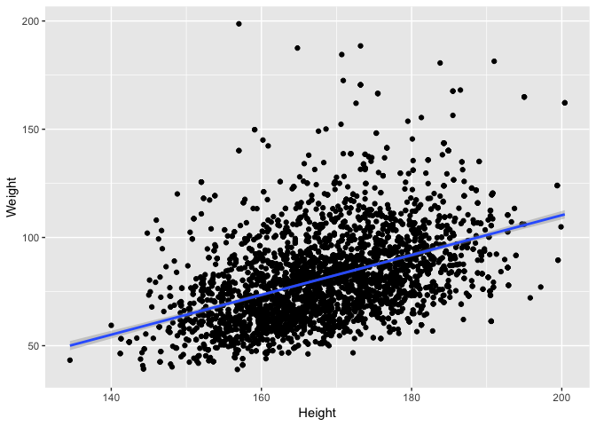<!-- -->

By default, this is only going to show the prediction over the range of the data. This is important! _Friends don't let friends extrapolate_

Assumptions of linear model:
1. Random Sampling
2. Equal variance across levels of X
3. Normality of residuals
4. Independent residuals
5. Linear relationship between X and Y

To check these assumptions, R has a nice built-in plotting feature

```r
plot(fit) #normality not perfect...but robust to departures --> ok
```

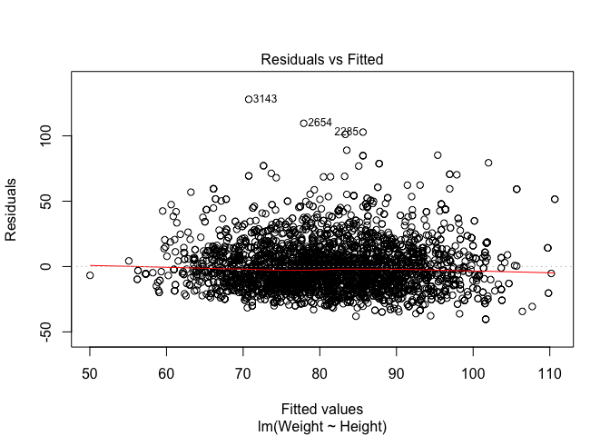<!-- -->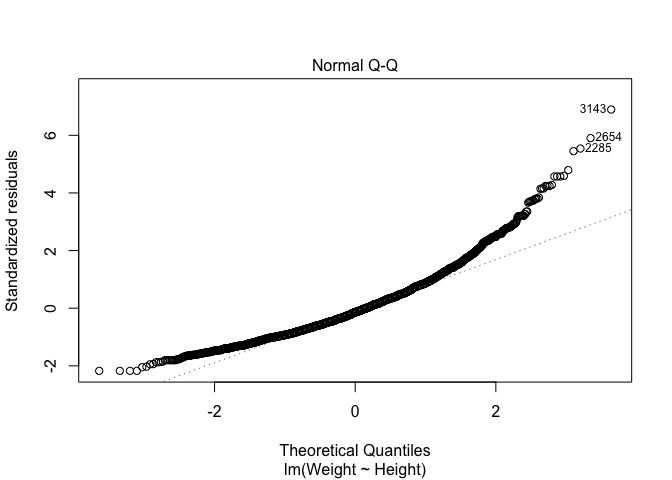<!-- -->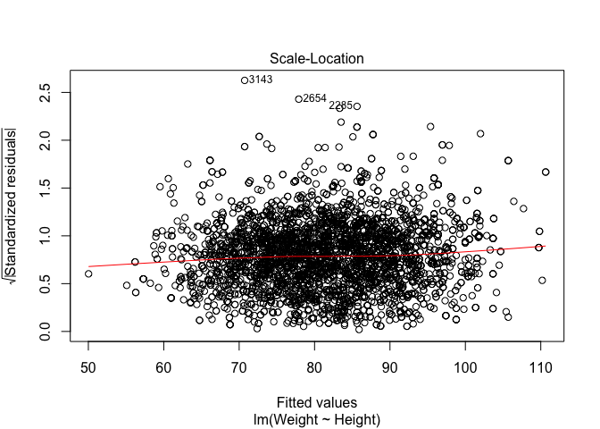<!-- -->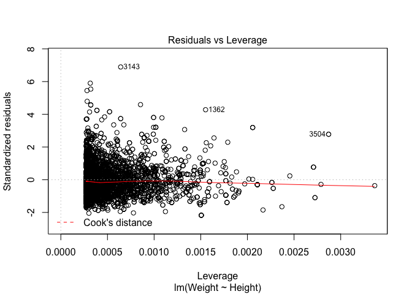<!-- -->

### EXERCISE 1 ###
** YOUR TURN **
This should mostly be a review from last session. 

1. Starting with the nhanes dataset, create a dataset of children aged 2-10

```
## # A tibble: 640 x 32
##       id Gender   Age Race     Education MaritalStatus RelationshipStatus
##    <int> <fct>  <int> <fct>    <fct>     <fct>         <fct>             
##  1 62175 male       5 White    <NA>      <NA>          <NA>              
##  2 62219 female     2 Mexican  <NA>      <NA>          <NA>              
##  3 62235 female     2 White    <NA>      <NA>          <NA>              
##  4 62241 male       2 Hispanic <NA>      <NA>          <NA>              
##  5 62257 female     2 Mexican  <NA>      <NA>          <NA>              
##  6 62263 male       2 White    <NA>      <NA>          <NA>              
##  7 62271 male       7 Black    <NA>      <NA>          <NA>              
##  8 62276 male       9 White    <NA>      <NA>          <NA>              
##  9 62313 male       7 Mexican  <NA>      <NA>          <NA>              
## 10 62323 female     2 Black    <NA>      <NA>          <NA>              
## # ... with 630 more rows, and 25 more variables: Insured <fct>,
## #   Income <int>, Poverty <dbl>, HomeRooms <int>, HomeOwn <fct>,
## #   Work <fct>, Weight <dbl>, Height <dbl>, BMI <dbl>, Pulse <int>,
## #   BPSys <int>, BPDia <int>, Testosterone <dbl>, HDLChol <dbl>,
## #   TotChol <dbl>, Diabetes <fct>, DiabetesAge <int>, nPregnancies <int>,
## #   nBabies <int>, SleepHrsNight <int>, PhysActive <fct>,
## #   PhysActiveDays <int>, AlcoholDay <int>, AlcoholYear <int>,
## #   SmokingStatus <fct>
```

2. Fit a linear model of `Height` against `Age` for the dataset of the children. Assign this to an object called `fit`. 

```
## 
## Call:
## lm(formula = Height ~ Age, data = kids)
## 
## Coefficients:
## (Intercept)          Age  
##      79.177        6.693
```

3. Get some `summary()` statistics on the fit. What is your interpretation of the output?

```
## 
## Call:
## lm(formula = Height ~ Age, data = kids)
## 
## Residuals:
##     Min      1Q  Median      3Q     Max 
## -16.132  -3.940  -0.311   3.627  23.375 
## 
## Coefficients:
##             Estimate Std. Error t value Pr(>|t|)    
## (Intercept) 79.17730    0.54577  145.07   <2e-16 ***
## Age          6.69349    0.08614   77.71   <2e-16 ***
## ---
## Signif. codes:  0 '***' 0.001 '**' 0.01 '*' 0.05 '.' 0.1 ' ' 1
## 
## Residual standard error: 5.491 on 628 degrees of freedom
##   (10 observations deleted due to missingness)
## Multiple R-squared:  0.9058,	Adjusted R-squared:  0.9056 
## F-statistic:  6038 on 1 and 628 DF,  p-value: < 2.2e-16
```

4. Create a plot showing the data and the linear model relationship.

```
## Warning: Removed 10 rows containing non-finite values (stat_smooth).
```

```
## Warning: Removed 10 rows containing missing values (geom_point).
```

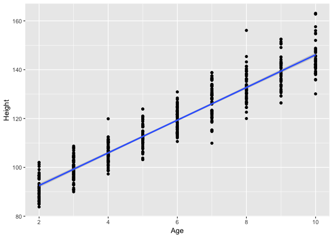<!-- -->

### Multiple regression
Slides 7-11

Most biological problems cannot easily be explained by one variable. Typically several predictors influence an outcome. Let's do a multiple linear regression analysis, where we attempt to model the effect of multiple predictor variables at once on some outcome. First, let's look at the effect of physical activity on testosterone levels.


```r
summary(lm(Testosterone~PhysActive, data=adults))
```

```
## 
## Call:
## lm(formula = Testosterone ~ PhysActive, data = adults)
## 
## Residuals:
##    Min     1Q Median     3Q    Max 
## -224.5 -196.5 -115.9  167.0 1588.0 
## 
## Coefficients:
##               Estimate Std. Error t value Pr(>|t|)    
## (Intercept)    207.565      5.873   35.34   <2e-16 ***
## PhysActiveYes   19.267      7.929    2.43   0.0152 *  
## ---
## Signif. codes:  0 '***' 0.001 '**' 0.01 '*' 0.05 '.' 0.1 ' ' 1
## 
## Residual standard error: 231.4 on 3436 degrees of freedom
##   (269 observations deleted due to missingness)
## Multiple R-squared:  0.001715,	Adjusted R-squared:  0.001425 
## F-statistic: 5.904 on 1 and 3436 DF,  p-value: 0.01516
```

The p-value is significant (p=0.01516), and the result suggests that increased physical activity is associated with increased testosterone levels. Does increasing your physical activity increase your testosterone levels? Or is it the other way -- will increased testosterone encourage more physical activity? Or is it none of the above -- is the apparent relationship between physical activity and testosterone levels only apparent because both are correlated with yet a third, unaccounted for variable? Notice that the R^2 value is quite low suggesting that we have not done a good job of explaining our Y quite yet.

Let's throw Age into the model as well.


```r
summary(lm(Testosterone~PhysActive+Age, data=adults))
```

```
## 
## Call:
## lm(formula = Testosterone ~ PhysActive + Age, data = adults)
## 
## Residuals:
##    Min     1Q Median     3Q    Max 
## -238.6 -196.8 -112.3  167.4 1598.1 
## 
## Coefficients:
##               Estimate Std. Error t value Pr(>|t|)    
## (Intercept)   247.8828    13.0853  18.944  < 2e-16 ***
## PhysActiveYes  13.6740     8.0815   1.692 0.090735 .  
## Age            -0.8003     0.2322  -3.447 0.000574 ***
## ---
## Signif. codes:  0 '***' 0.001 '**' 0.01 '*' 0.05 '.' 0.1 ' ' 1
## 
## Residual standard error: 231 on 3435 degrees of freedom
##   (269 observations deleted due to missingness)
## Multiple R-squared:  0.005156,	Adjusted R-squared:  0.004577 
## F-statistic: 8.901 on 2 and 3435 DF,  p-value: 0.0001394
```

This shows us that after accounting for age that the testosterone / physical activity link is no longer significant. Every 1-year increase in age results in a highly significant decrease in testosterone, and since increasing age is also likely associated with decreased physical activity, perhaps age is the  confounder that makes this relationship apparent.

Adding other predictors can also swing things the other way. We know that men have much higher testosterone levels than females. Sex is probably the single best predictor of testosterone levels in our dataset. By not accounting for this effect, our unaccounted-for variation remains very high (low $$R^{2}$$). By accounting for Gender, we now reduce the residual error in the model, and the physical activity effect once again becomes significant. Also notice that our model fits much better (higher R-squared), and is much more significant overall.


```r
summary(lm(Testosterone ~ PhysActive+Age+Gender, data=adults))
```

```
## 
## Call:
## lm(formula = Testosterone ~ PhysActive + Age + Gender, data = adults)
## 
## Residuals:
##     Min      1Q  Median      3Q     Max 
## -397.91  -31.01   -4.42   20.50 1400.90 
## 
## Coefficients:
##               Estimate Std. Error t value Pr(>|t|)    
## (Intercept)    46.6931     7.5729   6.166 7.83e-10 ***
## PhysActiveYes   9.2749     4.4617   2.079   0.0377 *  
## Age            -0.5904     0.1282  -4.605 4.28e-06 ***
## Gendermale    385.1989     4.3512  88.526  < 2e-16 ***
## ---
## Signif. codes:  0 '***' 0.001 '**' 0.01 '*' 0.05 '.' 0.1 ' ' 1
## 
## Residual standard error: 127.5 on 3434 degrees of freedom
##   (269 observations deleted due to missingness)
## Multiple R-squared:  0.6969,	Adjusted R-squared:  0.6966 
## F-statistic:  2632 on 3 and 3434 DF,  p-value: < 2.2e-16
```

The way that we have modeled is called forward selection where we start with a simple model and then add predictors, one at a time to determine each predictor's influence.

We could also use a likelihood ratio test where we compare nested models to determine whether the addition of a term was "worth it".

Let's conduct a likelihood ratio test on the below two models to determine whether PhysActive belongs in the model

```r
redfit <- lm(Testosterone ~ Age+Gender, data=adults)
fit1 <- lm(Testosterone ~ PhysActive+Age+Gender, data=adults)

anova(redfit, fit1) #just barely but yes, keep PhysActive
```

```
## Analysis of Variance Table
## 
## Model 1: Testosterone ~ Age + Gender
## Model 2: Testosterone ~ PhysActive + Age + Gender
##   Res.Df      RSS Df Sum of Sq      F  Pr(>F)  
## 1   3435 55917906                              
## 2   3434 55847628  1     70278 4.3213 0.03771 *
## ---
## Signif. codes:  0 '***' 0.001 '**' 0.01 '*' 0.05 '.' 0.1 ' ' 1
```


### EXERCISE 2 ###
** YOUR TURN **
1. Examine the relationship between HDL cholesterol levels (`HDLChol`) and whether someone has diabetes or not (`Diabetes`).
- Is there a difference between diabetics and nondiabetics? Perform a linear model to find out.

```
## 
## Call:
## lm(formula = HDLChol ~ Diabetes, data = adults)
## 
## Residuals:
##      Min       1Q   Median       3Q      Max 
## -0.97469 -0.27469 -0.06469  0.21531  2.80487 
## 
## Coefficients:
##              Estimate Std. Error t value Pr(>|t|)    
## (Intercept)  1.384686   0.006949 199.262  < 2e-16 ***
## DiabetesYes -0.159551   0.022461  -7.103 1.47e-12 ***
## ---
## Signif. codes:  0 '***' 0.001 '**' 0.01 '*' 0.05 '.' 0.1 ' ' 1
## 
## Residual standard error: 0.3909 on 3498 degrees of freedom
##   (207 observations deleted due to missingness)
## Multiple R-squared:  0.01422,	Adjusted R-squared:  0.01394 
## F-statistic: 50.46 on 1 and 3498 DF,  p-value: 1.469e-12
```

- Does the relationship hold when adjusting for `Weight`?

```
## 
## Call:
## lm(formula = HDLChol ~ Diabetes + Weight, data = adults)
## 
## Residuals:
##      Min       1Q   Median       3Q      Max 
## -0.86578 -0.23880 -0.05386  0.18343  2.54455 
## 
## Coefficients:
##               Estimate Std. Error t value Pr(>|t|)    
## (Intercept)  2.0030588  0.0247582  80.905  < 2e-16 ***
## DiabetesYes -0.0618412  0.0209921  -2.946  0.00324 ** 
## Weight      -0.0076729  0.0002964 -25.884  < 2e-16 ***
## ---
## Signif. codes:  0 '***' 0.001 '**' 0.01 '*' 0.05 '.' 0.1 ' ' 1
## 
## Residual standard error: 0.3574 on 3473 degrees of freedom
##   (231 observations deleted due to missingness)
## Multiple R-squared:  0.1724,	Adjusted R-squared:  0.1719 
## F-statistic: 361.7 on 2 and 3473 DF,  p-value: < 2.2e-16
```

FYI, in case you thought to use likelihood ratio test for the above.

```r
redfit <- lm(HDLChol ~ Diabetes, data = adults)
fit <- lm(HDLChol ~ Diabetes + Weight, data = adults)
# anova(redfit, fit) error
```

Instead, you need to first make a dataset where these 2 variables are not missing

```r
pres <- adults %>%
  filter(!is.na(Diabetes) & !is.na(Weight))

redfit <- lm(HDLChol ~ Diabetes, data = pres)
fit <- lm(HDLChol ~ Diabetes + Weight, data = pres)
anova(redfit, fit) #keep weight
```

```
## Analysis of Variance Table
## 
## Model 1: HDLChol ~ Diabetes
## Model 2: HDLChol ~ Diabetes + Weight
##   Res.Df    RSS Df Sum of Sq      F    Pr(>F)    
## 1   3474 529.09                                  
## 2   3473 443.53  1    85.561 669.98 < 2.2e-16 ***
## ---
## Signif. codes:  0 '***' 0.001 '**' 0.01 '*' 0.05 '.' 0.1 ' ' 1
```

- What about when adjusting for `Weight`, `Age`, `Gender`, `PhysActive` (whether someone participates in moderate or vigorous-intensity sports, fitness or recreational activities, coded as yes/no). What is the effect of each of these explanatory variables?


```
## 
## Call:
## lm(formula = HDLChol ~ Diabetes + Weight + Age, data = adults)
## 
## Residuals:
##      Min       1Q   Median       3Q      Max 
## -0.97616 -0.24000 -0.04785  0.19967  2.49773 
## 
## Coefficients:
##               Estimate Std. Error t value Pr(>|t|)    
## (Intercept)  1.8451779  0.0299783  61.550  < 2e-16 ***
## DiabetesYes -0.1089553  0.0213822  -5.096 3.66e-07 ***
## Weight      -0.0075353  0.0002934 -25.684  < 2e-16 ***
## Age          0.0032486  0.0003563   9.117  < 2e-16 ***
## ---
## Signif. codes:  0 '***' 0.001 '**' 0.01 '*' 0.05 '.' 0.1 ' ' 1
## 
## Residual standard error: 0.3532 on 3472 degrees of freedom
##   (231 observations deleted due to missingness)
## Multiple R-squared:  0.1917,	Adjusted R-squared:  0.191 
## F-statistic: 274.5 on 3 and 3472 DF,  p-value: < 2.2e-16
```

```
## 
## Call:
## lm(formula = HDLChol ~ Diabetes + Weight + Age + Gender, data = adults)
## 
## Residuals:
##      Min       1Q   Median       3Q      Max 
## -1.03763 -0.22615 -0.03774  0.16930  2.44113 
## 
## Coefficients:
##               Estimate Std. Error t value Pr(>|t|)    
## (Intercept)  1.8191910  0.0289582  62.821  < 2e-16 ***
## DiabetesYes -0.1120995  0.0206236  -5.435 5.84e-08 ***
## Weight      -0.0059140  0.0003002 -19.700  < 2e-16 ***
## Age          0.0031075  0.0003438   9.039  < 2e-16 ***
## Gendermale  -0.1985670  0.0122811 -16.168  < 2e-16 ***
## ---
## Signif. codes:  0 '***' 0.001 '**' 0.01 '*' 0.05 '.' 0.1 ' ' 1
## 
## Residual standard error: 0.3407 on 3471 degrees of freedom
##   (231 observations deleted due to missingness)
## Multiple R-squared:  0.2483,	Adjusted R-squared:  0.2475 
## F-statistic: 286.7 on 4 and 3471 DF,  p-value: < 2.2e-16
```

```
## 
## Call:
## lm(formula = HDLChol ~ Diabetes + Weight + Age + Gender + PhysActive, 
##     data = adults)
## 
## Residuals:
##      Min       1Q   Median       3Q      Max 
## -1.01071 -0.22476 -0.03897  0.17061  2.46291 
## 
## Coefficients:
##                 Estimate Std. Error t value Pr(>|t|)    
## (Intercept)    1.7550492  0.0310238  56.571  < 2e-16 ***
## DiabetesYes   -0.1049672  0.0205735  -5.102 3.54e-07 ***
## Weight        -0.0057673  0.0003000 -19.221  < 2e-16 ***
## Age            0.0034611  0.0003481   9.944  < 2e-16 ***
## Gendermale    -0.2016460  0.0122401 -16.474  < 2e-16 ***
## PhysActiveYes  0.0665538  0.0118837   5.600 2.30e-08 ***
## ---
## Signif. codes:  0 '***' 0.001 '**' 0.01 '*' 0.05 '.' 0.1 ' ' 1
## 
## Residual standard error: 0.3392 on 3470 degrees of freedom
##   (231 observations deleted due to missingness)
## Multiple R-squared:  0.2551,	Adjusted R-squared:  0.254 
## F-statistic: 237.6 on 5 and 3470 DF,  p-value: < 2.2e-16
```

# -----

A different strategy for model selection is backwards selection where we start with several variables and then determine which to drop first. This time, let's begin with a large model and use information criterion to select terms to drop.

Fit large model to predict Testosterone values

```r
fit <- lm(Testosterone ~ PhysActive + Age + Gender + SleepHrsNight + AlcoholYear + BMI, data=adults)
drop1(fit, test="F")
```

```
## Single term deletions
## 
## Model:
## Testosterone ~ PhysActive + Age + Gender + SleepHrsNight + AlcoholYear + 
##     BMI
##               Df Sum of Sq       RSS   AIC   F value    Pr(>F)    
## <none>                      46071613 27049                        
## PhysActive     1      5747  46077360 27048    0.3463 0.5562596    
## Age            1    187851  46259464 27059   11.3188 0.0007777 ***
## Gender         1 101032495 147104107 30278 6087.6142 < 2.2e-16 ***
## SleepHrsNight  1    110574  46182187 27054    6.6625 0.0098969 ** 
## AlcoholYear    1       321  46071934 27047    0.0193 0.8894128    
## BMI            1   2395455  48467067 27188  144.3358 < 2.2e-16 ***
## ---
## Signif. codes:  0 '***' 0.001 '**' 0.01 '*' 0.05 '.' 0.1 ' ' 1
```

Drop AlcoholYear

```r
fit <- lm(Testosterone ~ PhysActive + Age + Gender + SleepHrsNight + BMI, data=adults)
drop1(fit, test = "F")
```

```
## Single term deletions
## 
## Model:
## Testosterone ~ PhysActive + Age + Gender + SleepHrsNight + BMI
##               Df Sum of Sq       RSS   AIC   F value    Pr(>F)    
## <none>                      51555796 32777                        
## PhysActive     1     11098  51566893 32776    0.7314    0.3925    
## Age            1    269694  51825490 32793   17.7753 2.551e-05 ***
## Gender         1 125168410 176724205 36969 8249.7467 < 2.2e-16 ***
## SleepHrsNight  1    241978  51797774 32791   15.9486 6.646e-05 ***
## BMI            1   2805411  54361207 32955  184.9023 < 2.2e-16 ***
## ---
## Signif. codes:  0 '***' 0.001 '**' 0.01 '*' 0.05 '.' 0.1 ' ' 1
```

Drop PhysActive

```r
fit <- lm(Testosterone ~ Gender + SleepHrsNight + Age + TotChol + BMI, data = adults)
drop1(fit, test = "F") #drop none
```

```
## Single term deletions
## 
## Model:
## Testosterone ~ Gender + SleepHrsNight + Age + TotChol + BMI
##               Df Sum of Sq       RSS   AIC   F value    Pr(>F)    
## <none>                      51490135 32773                        
## Gender         1 122801562 174291697 36921 8104.0709 < 2.2e-16 ***
## SleepHrsNight  1    242510  51732645 32787   16.0040 6.456e-05 ***
## Age            1    242440  51732575 32787   15.9994 6.471e-05 ***
## TotChol        1     76758  51566893 32776    5.0655   0.02447 *  
## BMI            1   2876805  54366940 32956  189.8497 < 2.2e-16 ***
## ---
## Signif. codes:  0 '***' 0.001 '**' 0.01 '*' 0.05 '.' 0.1 ' ' 1
```

Final model has Gender + BMI + SleepHrsNight + Age + TotChol

```r
summary(lm(Testosterone ~ Gender + SleepHrsNight + Age + TotChol + BMI, data = adults))
```

```
## 
## Call:
## lm(formula = Testosterone ~ Gender + SleepHrsNight + Age + TotChol + 
##     BMI, data = adults)
## 
## Residuals:
##     Min      1Q  Median      3Q     Max 
## -401.53  -48.98   -7.50   37.34 1378.89 
## 
## Coefficients:
##               Estimate Std. Error t value Pr(>|t|)    
## (Intercept)   244.3909    18.8181  12.987  < 2e-16 ***
## Gendermale    383.6228     4.2614  90.023  < 2e-16 ***
## SleepHrsNight  -6.4630     1.6155  -4.000 6.46e-05 ***
## Age            -0.4964     0.1241  -4.000 6.47e-05 ***
## TotChol        -4.6024     2.0449  -2.251   0.0245 *  
## BMI            -4.5117     0.3274 -13.779  < 2e-16 ***
## ---
## Signif. codes:  0 '***' 0.001 '**' 0.01 '*' 0.05 '.' 0.1 ' ' 1
## 
## Residual standard error: 123.1 on 3398 degrees of freedom
##   (303 observations deleted due to missingness)
## Multiple R-squared:  0.7162,	Adjusted R-squared:  0.7158 
## F-statistic:  1715 on 5 and 3398 DF,  p-value: < 2.2e-16
```

### EXERCISE 3 ###
** YOUR TURN **

Fit a large model to predict `Weight` using `Height`, `Gender`, `Work`, `TotChol`, and `Pulse`.


1. Use the drop1 function to select terms to drop one by one.

2. Continue to drop terms until you reach a final model. Which predictors are in the final model? What is their effect on Weight? Which is the strongest predictor?

```
## Single term deletions
## 
## Model:
## Weight ~ Height + Gender + Work + TotChol + Pulse
##         Df Sum of Sq     RSS   AIC
## <none>               1146965 19661
## Height   1    127458 1274423 20014
## Gender   1      4029 1150994 19671
## Work     2       715 1147680 19659
## TotChol  1       481 1147447 19660
## Pulse    1     15628 1162593 19705
```

```
## Single term deletions
## 
## Model:
## Weight ~ Height + Gender + TotChol + Pulse
##         Df Sum of Sq     RSS   AIC
## <none>               1147692 19664
## Height   1    134497 1282189 20036
## Gender   1      4052 1151744 19674
## TotChol  1       513 1148205 19663
## Pulse    1     15422 1163114 19707
```

```
## Single term deletions
## 
## Model:
## Weight ~ Height + Gender + Pulse
##        Df Sum of Sq     RSS   AIC
## <none>              1226728 20797
## Height  1    143328 1370056 21188
## Gender  1      3685 1230413 20806
## Pulse   1     16417 1243145 20842
```

```
## 
## Call:
## lm(formula = Weight ~ Height + Gender + Pulse, data = adults)
## 
## Residuals:
##     Min      1Q  Median      3Q     Max 
## -44.159 -12.947  -2.705   9.679 119.093 
## 
## Coefficients:
##              Estimate Std. Error t value Pr(>|t|)    
## (Intercept) -75.22582    6.94026 -10.839  < 2e-16 ***
## Height        0.84341    0.04139  20.377  < 2e-16 ***
## Gendermale    2.77091    0.84808   3.267   0.0011 ** 
## Pulse         0.18078    0.02621   6.897 6.28e-12 ***
## ---
## Signif. codes:  0 '***' 0.001 '**' 0.01 '*' 0.05 '.' 0.1 ' ' 1
## 
## Residual standard error: 18.58 on 3554 degrees of freedom
##   (149 observations deleted due to missingness)
## Multiple R-squared:  0.2133,	Adjusted R-squared:  0.2126 
## F-statistic: 321.2 on 3 and 3554 DF,  p-value: < 2.2e-16
```

# Logistic Regression
Slides 12 - 14

Until now we've only discussed analyzing _continuous_ outcomes / dependent variables. We've tested for differences in means between _n_ groups using ANOVA, and more general relationships using linear regression. In all of these cases, the dependent variable, i.e., the outcome, or $Y$ variable, was _continuous_. 

But, what if our outcome variable is _discrete_, e.g., "Yes/No", "Mutant/WT", "Case/Control", etc.? Here we use a different set of procedures for assessing significant associations.

What if we wanted to model the discrete outcome, e.g., whether someone is insured, against several other variables, similar to how we did with multiple linear regression? We can't use linear regression because the outcome isn't continuous -- it's binary, either _Yes_ or _No_. For this we'll use _logistic regression_ to model the _log odds_ of binary response. That is, instead of modeling the outcome variable, $Y$, directly against the inputs, we'll model the _log odds_ of the outcome variable.

If $p$ is the probability that the individual is insured, then $\frac{p}{1-p}$ is the [_odds_](https://en.wikipedia.org/wiki/Odds) that person is insured. Then it follows that the linear model is expressed as:

$$log(\frac{p}{1-p}) = \beta_0 + \beta_1 x_1 + \cdots + \beta_k x_k$$

Where $\beta_0$ is the intercept, $\beta_1$ is the increase in the log odds of the outcome for every unit increase in $x_1$, and so on.

Logistic regression is a type of _generalized linear model_ (GLM). We fit GLM models in R using the `glm()` function. It works like the `lm()` function except we specify which GLM to fit using the `family` argument. Logistic regression requires `family=binomial`.

The typical use looks like this:

```r
mod <- glm(y ~ x, data=yourdata, family='binomial')
summary(mod)
```

Before we fit a logistic regression model let's _relevel_ the Race variable so that "White" is the baseline. We saw above that people who identify as "White" have the highest rates of being insured. When we run the logistic regression, we'll get a separate coefficient (effect) for each level of the factor variable(s) in the model, telling you the increased odds that that level has, _as compared to the baseline group_.


```r
#Look at Race. The default ordering is alphabetical
adults$Race

# Let's relevel that where the group with the highest rate of insurance is "baseline"
relevel(adults$Race, ref="White")

# If we're happy with that result, permanently change it
adults$Race <- relevel(adults$Race, ref="White")

# Or do it the dplyr way
adults <- adults %>% 
  mutate(Race=relevel(Race, ref="White"))
```

Now, let's fit a logistic regression model assessing how the odds of being insured change with different levels of race. 


```r
fit <- glm(Insured~Race, data=adults, family="binomial")
summary(fit)
```

```
## 
## Call:
## glm(formula = Insured ~ Race, family = "binomial", data = adults)
## 
## Deviance Residuals: 
##     Min       1Q   Median       3Q      Max  
## -2.0377   0.5177   0.5177   0.5177   1.1952  
## 
## Coefficients:
##              Estimate Std. Error z value Pr(>|z|)    
## (Intercept)   1.94218    0.06103  31.825  < 2e-16 ***
## RaceAsian    -0.64092    0.17715  -3.618 0.000297 ***
## RaceBlack    -0.59744    0.13558  -4.406 1.05e-05 ***
## RaceHispanic -1.41354    0.14691  -9.622  < 2e-16 ***
## RaceMexican  -1.98385    0.13274 -14.946  < 2e-16 ***
## RaceOther    -1.26430    0.22229  -5.688 1.29e-08 ***
## ---
## Signif. codes:  0 '***' 0.001 '**' 0.01 '*' 0.05 '.' 0.1 ' ' 1
## 
## (Dispersion parameter for binomial family taken to be 1)
## 
##     Null deviance: 3614.6  on 3704  degrees of freedom
## Residual deviance: 3336.6  on 3699  degrees of freedom
##   (2 observations deleted due to missingness)
## AIC: 3348.6
## 
## Number of Fisher Scoring iterations: 4
```

The `Estimate` column shows the log of the odds ratio -- how the log odds of having health insurance changes at each level of race compared to White. The P-value for each coefficient is on the far right. This shows that _every_ other race has a _significantly lower_ rate of health insurance coverage as compared to White people. The log odds of being insured for a person who self-identifies as Asian is 0.64 less than the log odds of being insured for a White person.

To get the odds ratio rather than the log odds, we exponentiate

```r
exp(fit$coefficients)
```

```
##  (Intercept)    RaceAsian    RaceBlack RaceHispanic  RaceMexican 
##    6.9739414    0.5268058    0.5502210    0.2432813    0.1375382 
##    RaceOther 
##    0.2824367
```
The odds of being insured if you are Asian are 0.53 to 1., etc.

As in our multiple linear regression analysis above, are there other important variables that we're leaving out that could alter our conclusions? Lets add a few more variables into the model to see if something else can explain the apparent Race-Insured association. Let's add a few things likely to be involved (Age and Income), and something that's probably irrelevant (hours slept at night).


```r
fit <- glm(Insured ~ Age+Income+SleepHrsNight+Race, data=adults, family="binomial")
summary(fit)
```

```
## 
## Call:
## glm(formula = Insured ~ Age + Income + SleepHrsNight + Race, 
##     family = "binomial", data = adults)
## 
## Deviance Residuals: 
##     Min       1Q   Median       3Q      Max  
## -2.4815   0.3025   0.4370   0.6252   1.6871  
## 
## Coefficients:
##                 Estimate Std. Error z value Pr(>|z|)    
## (Intercept)   -3.501e-01  2.919e-01  -1.199    0.230    
## Age            3.371e-02  2.949e-03  11.431  < 2e-16 ***
## Income         1.534e-05  1.537e-06   9.982  < 2e-16 ***
## SleepHrsNight -1.763e-02  3.517e-02  -0.501    0.616    
## RaceAsian     -4.550e-01  2.031e-01  -2.241    0.025 *  
## RaceBlack     -2.387e-01  1.536e-01  -1.554    0.120    
## RaceHispanic  -1.010e+00  1.635e-01  -6.175 6.61e-10 ***
## RaceMexican   -1.404e+00  1.483e-01  -9.468  < 2e-16 ***
## RaceOther     -9.888e-01  2.422e-01  -4.082 4.46e-05 ***
## ---
## Signif. codes:  0 '***' 0.001 '**' 0.01 '*' 0.05 '.' 0.1 ' ' 1
## 
## (Dispersion parameter for binomial family taken to be 1)
## 
##     Null deviance: 3284.3  on 3395  degrees of freedom
## Residual deviance: 2815.0  on 3387  degrees of freedom
##   (311 observations deleted due to missingness)
## AIC: 2833
## 
## Number of Fisher Scoring iterations: 5
```

```r
drop1(fit, test = "LRT")
```

```
## Single term deletions
## 
## Model:
## Insured ~ Age + Income + SleepHrsNight + Race
##               Df Deviance    AIC     LRT Pr(>Chi)    
## <none>             2815.0 2833.0                     
## Age            1   2959.0 2975.0 143.984   <2e-16 ***
## Income         1   2920.5 2936.5 105.444   <2e-16 ***
## SleepHrsNight  1   2815.3 2831.3   0.251   0.6161    
## Race           5   2930.2 2938.2 115.154   <2e-16 ***
## ---
## Signif. codes:  0 '***' 0.001 '**' 0.01 '*' 0.05 '.' 0.1 ' ' 1
```

```r
fit <- glm(Insured ~ Age+Income+Race, data=adults, family="binomial")
drop1(fit)
```

```
## Single term deletions
## 
## Model:
## Insured ~ Age + Income + Race
##        Df Deviance    AIC
## <none>      2821.6 2837.6
## Age     1   2966.4 2980.4
## Income  1   2927.0 2941.0
## Race    5   2936.5 2942.5
```

```r
summary(fit)
```

```
## 
## Call:
## glm(formula = Insured ~ Age + Income + Race, family = "binomial", 
##     data = adults)
## 
## Deviance Residuals: 
##     Min       1Q   Median       3Q      Max  
## -2.4883   0.3025   0.4360   0.6251   1.6945  
## 
## Coefficients:
##                Estimate Std. Error z value Pr(>|z|)    
## (Intercept)  -4.767e-01  1.610e-01  -2.961  0.00306 ** 
## Age           3.383e-02  2.950e-03  11.467  < 2e-16 ***
## Income        1.530e-05  1.533e-06   9.982  < 2e-16 ***
## RaceAsian    -4.540e-01  2.029e-01  -2.237  0.02527 *  
## RaceBlack    -2.108e-01  1.531e-01  -1.377  0.16857    
## RaceHispanic -1.002e+00  1.632e-01  -6.137 8.43e-10 ***
## RaceMexican  -1.402e+00  1.482e-01  -9.461  < 2e-16 ***
## RaceOther    -9.789e-01  2.418e-01  -4.048 5.17e-05 ***
## ---
## Signif. codes:  0 '***' 0.001 '**' 0.01 '*' 0.05 '.' 0.1 ' ' 1
## 
## (Dispersion parameter for binomial family taken to be 1)
## 
##     Null deviance: 3290.9  on 3404  degrees of freedom
## Residual deviance: 2821.5  on 3397  degrees of freedom
##   (302 observations deleted due to missingness)
## AIC: 2837.5
## 
## Number of Fisher Scoring iterations: 5
```

A few things become apparent:

1. Age and income are both highly associated with whether someone is insured. Both of these variables are highly significant ($P<2.2 \times 10^{-16}$), and the coefficient (the `Estimate` column) is positive, meaning that for each unit increase in one of these variables, the odds of being insured increases by the corresponding amount.
1. Hours slept per night is not meaningful at all.
1. After accounting for age and income, several of the race-specific differences are no longer statistically significant, but others remain so.
1. The absolute value of the test statistic (column called `z value`) can roughly be taken as an estimate of the "importance" of that variable to the overall model. So, age and income are the most important influences in this model; self-identifying as Hispanic or Mexican are also very highly important, hours slept per night isn't important at all, and the other race categories fall somewhere in between.


### EXERCISE 4 ###
** YOUR TURN **
1. Model the association between `Diabetes` and `PhysActive` in a logistic regression framework to assess the risk of diabetes using physical activity as a predictor.
  - Fit a model with just physical activity as a predictor, and display a model summary.


```
## 
## Call:
## glm(formula = Diabetes ~ PhysActive, family = "binomial", data = adults)
## 
## Deviance Residuals: 
##     Min       1Q   Median       3Q      Max  
## -0.5406  -0.5406  -0.3681  -0.3681   2.3348  
## 
## Coefficients:
##               Estimate Std. Error z value Pr(>|z|)    
## (Intercept)   -1.84948    0.07094 -26.073  < 2e-16 ***
## PhysActiveYes -0.80834    0.11462  -7.052 1.76e-12 ***
## ---
## Signif. codes:  0 '***' 0.001 '**' 0.01 '*' 0.05 '.' 0.1 ' ' 1
## 
## (Dispersion parameter for binomial family taken to be 1)
## 
##     Null deviance: 2371.7  on 3706  degrees of freedom
## Residual deviance: 2319.9  on 3705  degrees of freedom
## AIC: 2323.9
## 
## Number of Fisher Scoring iterations: 5
```

  - Add gender to the model, and show a summary.
  

```
## 
## Call:
## glm(formula = Diabetes ~ PhysActive + Gender, family = "binomial", 
##     data = adults)
## 
## Deviance Residuals: 
##     Min       1Q   Median       3Q      Max  
## -0.5686  -0.5123  -0.3874  -0.3476   2.3820  
## 
## Coefficients:
##               Estimate Std. Error z value Pr(>|z|)    
## (Intercept)   -1.96460    0.09277 -21.177  < 2e-16 ***
## PhysActiveYes -0.81186    0.11470  -7.078 1.46e-12 ***
## Gendermale     0.22427    0.11191   2.004   0.0451 *  
## ---
## Signif. codes:  0 '***' 0.001 '**' 0.01 '*' 0.05 '.' 0.1 ' ' 1
## 
## (Dispersion parameter for binomial family taken to be 1)
## 
##     Null deviance: 2371.7  on 3706  degrees of freedom
## Residual deviance: 2315.9  on 3704  degrees of freedom
## AIC: 2321.9
## 
## Number of Fisher Scoring iterations: 5
```
  - Continue adding weight and age to the model. What happens to the gender association?
  

```
## 
## Call:
## glm(formula = Diabetes ~ PhysActive + Gender + Weight, family = "binomial", 
##     data = adults)
## 
## Deviance Residuals: 
##     Min       1Q   Median       3Q      Max  
## -1.4796  -0.4826  -0.3863  -0.3088   2.6136  
## 
## Coefficients:
##                Estimate Std. Error z value Pr(>|z|)    
## (Intercept)   -3.783385   0.229640 -16.475  < 2e-16 ***
## PhysActiveYes -0.723483   0.117174  -6.174 6.64e-10 ***
## Gendermale    -0.091769   0.118948  -0.772     0.44    
## Weight         0.022499   0.002492   9.028  < 2e-16 ***
## ---
## Signif. codes:  0 '***' 0.001 '**' 0.01 '*' 0.05 '.' 0.1 ' ' 1
## 
## (Dispersion parameter for binomial family taken to be 1)
## 
##     Null deviance: 2335.0  on 3679  degrees of freedom
## Residual deviance: 2205.2  on 3676  degrees of freedom
##   (27 observations deleted due to missingness)
## AIC: 2213.2
## 
## Number of Fisher Scoring iterations: 5
```

```
## 
## Call:
## glm(formula = Diabetes ~ PhysActive + Gender + Weight + Age, 
##     family = "binomial", data = adults)
## 
## Deviance Residuals: 
##     Min       1Q   Median       3Q      Max  
## -1.4615  -0.4753  -0.3039  -0.1813   3.0128  
## 
## Coefficients:
##                Estimate Std. Error z value Pr(>|z|)    
## (Intercept)   -7.583063   0.399467 -18.983  < 2e-16 ***
## PhysActiveYes -0.343631   0.123684  -2.778  0.00546 ** 
## Gendermale    -0.098664   0.124528  -0.792  0.42819    
## Weight         0.029906   0.002762  10.826  < 2e-16 ***
## Age            0.056361   0.004064  13.869  < 2e-16 ***
## ---
## Signif. codes:  0 '***' 0.001 '**' 0.01 '*' 0.05 '.' 0.1 ' ' 1
## 
## (Dispersion parameter for binomial family taken to be 1)
## 
##     Null deviance: 2335.0  on 3679  degrees of freedom
## Residual deviance: 1976.3  on 3675  degrees of freedom
##   (27 observations deleted due to missingness)
## AIC: 1986.3
## 
## Number of Fisher Scoring iterations: 6
```
  - Continue and add income to the model. What happens to the original association with physical activity?
  

```
## 
## Call:
## glm(formula = Diabetes ~ PhysActive + Gender + Weight + Age + 
##     Income, family = "binomial", data = adults)
## 
## Deviance Residuals: 
##     Min       1Q   Median       3Q      Max  
## -1.4831  -0.4692  -0.2933  -0.1822   2.9525  
## 
## Coefficients:
##                 Estimate Std. Error z value Pr(>|z|)    
## (Intercept)   -7.029e+00  4.191e-01 -16.771  < 2e-16 ***
## PhysActiveYes -1.958e-01  1.313e-01  -1.491    0.136    
## Gendermale     1.512e-02  1.311e-01   0.115    0.908    
## Weight         2.957e-02  2.862e-03  10.331  < 2e-16 ***
## Age            5.566e-02  4.162e-03  13.372  < 2e-16 ***
## Income        -1.141e-05  2.027e-06  -5.630  1.8e-08 ***
## ---
## Signif. codes:  0 '***' 0.001 '**' 0.01 '*' 0.05 '.' 0.1 ' ' 1
## 
## (Dispersion parameter for binomial family taken to be 1)
## 
##     Null deviance: 2171.7  on 3382  degrees of freedom
## Residual deviance: 1806.6  on 3377  degrees of freedom
##   (324 observations deleted due to missingness)
## AIC: 1818.6
## 
## Number of Fisher Scoring iterations: 6
```

  - Examine model fit parameters of the above models. Which is the best model and why?

```
## Single term deletions
## 
## Model:
## Diabetes ~ PhysActive + Gender + Weight + Age + Income
##            Df Deviance    AIC
## <none>          1806.6 1818.6
## PhysActive  1   1808.8 1818.8
## Gender      1   1806.6 1816.6
## Weight      1   1910.0 1920.0
## Age         1   2019.7 2029.7
## Income      1   1839.6 1849.6
```

```
## Single term deletions
## 
## Model:
## Diabetes ~ PhysActive + Weight + Age + Income
##            Df Deviance    AIC
## <none>          1806.6 1816.6
## PhysActive  1   1808.8 1816.8
## Weight      1   1920.4 1928.4
## Age         1   2019.7 2027.7
## Income      1   1840.0 1848.0
```

```
## 
## Call:
## glm(formula = Diabetes ~ PhysActive + Weight + Age + Income, 
##     family = "binomial", data = adults)
## 
## Deviance Residuals: 
##     Min       1Q   Median       3Q      Max  
## -1.4877  -0.4704  -0.2943  -0.1828   2.9501  
## 
## Coefficients:
##                 Estimate Std. Error z value Pr(>|z|)    
## (Intercept)   -7.030e+00  4.189e-01 -16.784  < 2e-16 ***
## PhysActiveYes -1.953e-01  1.313e-01  -1.488    0.137    
## Weight         2.966e-02  2.757e-03  10.758  < 2e-16 ***
## Age            5.566e-02  4.162e-03  13.373  < 2e-16 ***
## Income        -1.138e-05  2.010e-06  -5.663 1.49e-08 ***
## ---
## Signif. codes:  0 '***' 0.001 '**' 0.01 '*' 0.05 '.' 0.1 ' ' 1
## 
## (Dispersion parameter for binomial family taken to be 1)
## 
##     Null deviance: 2171.7  on 3382  degrees of freedom
## Residual deviance: 1806.6  on 3378  degrees of freedom
##   (324 observations deleted due to missingness)
## AIC: 1816.6
## 
## Number of Fisher Scoring iterations: 6
```
Although PhysActive is not itself significant, according to the AIC, it does help to explain Diabetes.

There is _much_ more to go into with logistic regression. This lesson only scratches the surface. Missing from this lesson are things like regression diagnostics, model comparison approaches, penalization, interpretation of model coefficients, fitting interaction effects, and much more. Alan Agresti's [_Categorical Data Analysis_](https://www.amazon.com/Categorical-Data-Analysis-Alan-Agresti/dp/0470463635/ref=sr_1_1?ie=UTF8&qid=1473180895&sr=8-1&keywords=categorical+data+analysis&tag=gettgenedone-20) has long been considered the definitive text on this topic. I also recommend Agresti's [_Introduction to Categorical Data Analysis_](https://www.amazon.com/Introduction-Categorical-Data-Analysis/dp/0471226181/ref=sr_1_3?ie=UTF8&qid=1473180895&sr=8-3&keywords=categorical+data+analysis&tag=gettgenedone-20) (a.k.a. "Agresti lite") for a gentler introduction.

# Multinomial Logistic Regression
Slide 15

What if your outcome variable is not binary (Yes / No, Disease / Healthy, 1 / 0), but instead has several classes. In our NHANES dataset, `Work` is an example of a cateogrical variable with more than 2 levels. Let's say we want to predict a person's working status based on other variables in the dataset.

Multinomial logistic regression is an extension of binary logistic regression but instead of creating one function that models 0 / 1, now we create a family of functions to model membership in each group:

$$Pr(Y = k | X) = \frac{e^ { \beta_{0k} + \beta_{1k} x_1 + \cdots + \beta_{pk} x_p}} {\sum_{l=1}^{K} e^ { \beta_{0l} + \beta_{1l} x_1 + \cdots + \beta_{pl} x_p}}$$

Where $k$ represents group membership, $p$ represents the number of predictors and $l$ represents the number of groups.

We will not have time to cover this topic here, but please see a tutorial of multinomial regression on the [UCLA Institute for Digital Research and Education website](https://stats.idre.ucla.edu/r/dae/multinomial-logistic-regression/)

# Mixed Effects Models
Slides 16-21

A mixed effects model is a linear model with both fixed effects and random effects. So far we have only seen fixed effects

This type of modeling is especially suitable for clustered, longitudinal, or repeated measures data where data are grouped by random levels and where the response variable is continuous

Example:
 - rat drink dataset in faraway package. Rats on 3 different drug treatments measured each week for 5 weeks (repeated measures data)
 - sleepstudy data from lme4 package (we'll use this today)

Random levels means that there are observations that belong to single subject or group that can be thought of as randomly selected from the population

Some excellent resources on the topic:
1. Julian Faraway. "Extending the Linear Model with R" published by CRC press in 1st Ed. December 2005 and 2nd Ed. March 2016, ISBN 9781584884248

1. Faraway R package

1. [Derek Sonderegger Statistical Methods II course](https://dereksonderegger.github.io/571/11-mixed-effects-models.html)

1. [Ben Bolker's GLMM FAQ](http://bbolker.github.io/mixedmodels-misc/glmmFAQ.html)


The first step is to install and load the lme4 library

```r
library(lme4)
```
If the above step fails, try to install the package using `install.packages(lme4)`

Load sleepstudy dataset from lme4 package

```r
ss <- sleepstudy
str(ss)
```

```
## 'data.frame':	180 obs. of  3 variables:
##  $ Reaction: num  250 259 251 321 357 ...
##  $ Days    : num  0 1 2 3 4 5 6 7 8 9 ...
##  $ Subject : Factor w/ 18 levels "308","309","310",..: 1 1 1 1 1 1 1 1 1 1 ...
```

These data consist of the average reaction time per day for subjects in a sleep deprivation study. On day 0 the subjects had their normal amount of sleep. Starting that night they were restricted to 3 hours of sleep per night. The observations represent the average reaction time on a series of tests given each day to each subject.

Look at reaction time for each patient

```r
ss %>%
  ggplot(aes(Days, Reaction)) +
  geom_point() + 
  facet_wrap(~Subject)
```

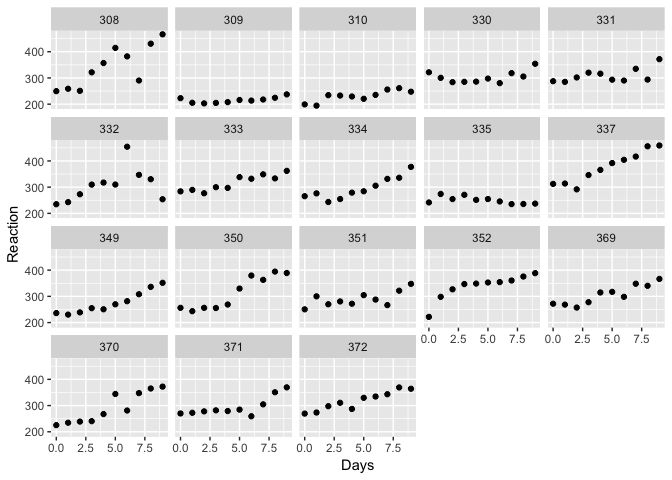<!-- -->

```r
#add line for each subject
ss %>%
  ggplot(aes(Days, Reaction)) +
  geom_point() + 
  geom_line() +
  facet_wrap(~Subject, ncol = 6)
```

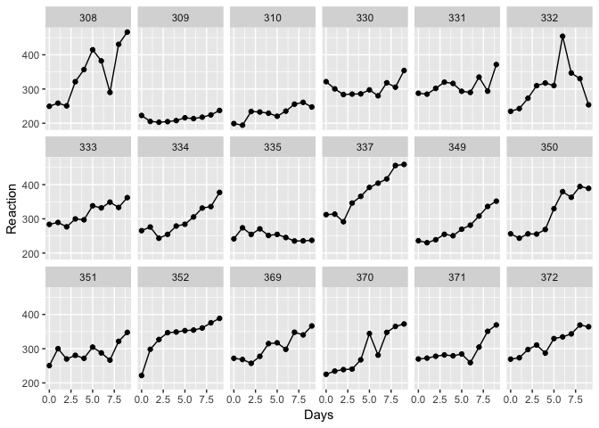<!-- -->
Looks like individual differences will be important. Each subject begins the study with a different baseline reaction time, so we will need a different intercept for each subject and it looks like sleep deprivation affects each person's reaction time differently, so we will likely also need a random slope.

### Fit LM

```r
summary(lm(Reaction ~ Days, data = ss))
```

```
## 
## Call:
## lm(formula = Reaction ~ Days, data = ss)
## 
## Residuals:
##      Min       1Q   Median       3Q      Max 
## -110.848  -27.483    1.546   26.142  139.953 
## 
## Coefficients:
##             Estimate Std. Error t value Pr(>|t|)    
## (Intercept)  251.405      6.610  38.033  < 2e-16 ***
## Days          10.467      1.238   8.454 9.89e-15 ***
## ---
## Signif. codes:  0 '***' 0.001 '**' 0.01 '*' 0.05 '.' 0.1 ' ' 1
## 
## Residual standard error: 47.71 on 178 degrees of freedom
## Multiple R-squared:  0.2865,	Adjusted R-squared:  0.2825 
## F-statistic: 71.46 on 1 and 178 DF,  p-value: 9.894e-15
```
A linear model finds a significant effect of days. For each additional day of sleep deprivation, average reaction time increases by 10.46 ms. However, this model ignores the fact that several of the measurements come from the same person (violates independent residuals assumption).

### Random intercept (same slope)
Because the baseline reaction time for each subject is different, let's fit a random intercept model. We are assuming here that the slope is the same for each subject.

```r
lmm1 <- lmer(Reaction ~ Days + (1 | Subject), data=ss)
summary(lmm1) #notice no p-values
```

```
## Linear mixed model fit by REML ['lmerMod']
## Formula: Reaction ~ Days + (1 | Subject)
##    Data: ss
## 
## REML criterion at convergence: 1786.5
## 
## Scaled residuals: 
##     Min      1Q  Median      3Q     Max 
## -3.2257 -0.5529  0.0109  0.5188  4.2506 
## 
## Random effects:
##  Groups   Name        Variance Std.Dev.
##  Subject  (Intercept) 1378.2   37.12   
##  Residual              960.5   30.99   
## Number of obs: 180, groups:  Subject, 18
## 
## Fixed effects:
##             Estimate Std. Error t value
## (Intercept) 251.4051     9.7467   25.79
## Days         10.4673     0.8042   13.02
## 
## Correlation of Fixed Effects:
##      (Intr)
## Days -0.371
```

```r
# if you want p-values, know that their calculation is an approximation that sometimes will not perform well. That is why authors of lme4 have not included them
library(lmerTest)
```

```
## 
## Attaching package: 'lmerTest'
```

```
## The following object is masked from 'package:lme4':
## 
##     lmer
```

```
## The following object is masked from 'package:stats':
## 
##     step
```

```r
lmm1 <- lmer(Reaction ~ Days + (1 | Subject), data=ss)
summary(lmm1)
```

```
## Linear mixed model fit by REML. t-tests use Satterthwaite's method [
## lmerModLmerTest]
## Formula: Reaction ~ Days + (1 | Subject)
##    Data: ss
## 
## REML criterion at convergence: 1786.5
## 
## Scaled residuals: 
##     Min      1Q  Median      3Q     Max 
## -3.2257 -0.5529  0.0109  0.5188  4.2506 
## 
## Random effects:
##  Groups   Name        Variance Std.Dev.
##  Subject  (Intercept) 1378.2   37.12   
##  Residual              960.5   30.99   
## Number of obs: 180, groups:  Subject, 18
## 
## Fixed effects:
##             Estimate Std. Error       df t value Pr(>|t|)    
## (Intercept) 251.4051     9.7467  22.8102   25.79   <2e-16 ***
## Days         10.4673     0.8042 161.0000   13.02   <2e-16 ***
## ---
## Signif. codes:  0 '***' 0.001 '**' 0.01 '*' 0.05 '.' 0.1 ' ' 1
## 
## Correlation of Fixed Effects:
##      (Intr)
## Days -0.371
```
Interpretation
Random effects:
between subject variation (SD) = 37.12 ms
within subject variation (SD) = 30.99 ms

(Intercept) = 251.40 means expected reaction time at time 0 = 251.4 ms

- Days 10.4673 -> means subjects add 10.5 ms to their reaction time each day

What is the Correlation of Fixed Effects matrix?
  - see explanation from lme4 author (Doug Bates):
  - https://stat.ethz.ch/pipermail/r-sig-mixed-models/2009q1/001941.html

See the random effects -- aka the intercept for each subject. aka the Best Linear Unbiased Predictions (BLUPs) 

```r
ranef(lmm1)
```

```
## $Subject
##     (Intercept)
## 308   40.783710
## 309  -77.849554
## 310  -63.108567
## 330    4.406442
## 331   10.216189
## 332    8.221238
## 333   16.500494
## 334   -2.996981
## 335  -45.282127
## 337   72.182686
## 349  -21.196249
## 350   14.111363
## 351   -7.862221
## 352   36.378425
## 369    7.036381
## 370   -6.362703
## 371   -3.294273
## 372   18.115747
```

```r
#reference is 251.40
```
These are the predicted effect of subject on intercept.
For example, For subj 1 we expect an additional 40.78 ms of reaction time at the intercept (251.40. + 40.78 = 292.18) 

Let's plot the regression line for each subject

```r
ss %>% 
  mutate(yhat = predict(lmm1)) %>%
  ggplot(aes(x=Days)) +
    facet_wrap(~ Subject, ncol=6) + 
    geom_point(aes(y=Reaction)) + 
    geom_line(aes(y=Reaction)) +
    geom_line(aes(y=yhat), color='red')
```

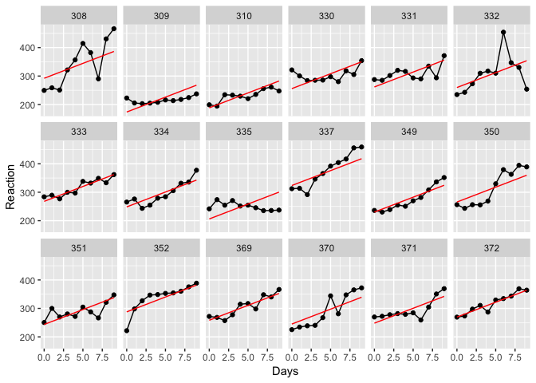<!-- -->

These don't look bad, but perhaps we can get a better fit by allowing for a varying slope by subject. For example, subjects 330 and 335 need a lower slope while 308, 337 and 350 need a higher slope

### Random intercept and Random slope model
This model allows each subject to have their own intercept and slope. In other words, the effect of sleep deprivation over days varies by subject (different slopes).

```r
lmm2 <- lmer(Reaction ~ Days + (Days | Subject), data=ss)
summary(lmm2)
```

```
## Linear mixed model fit by REML. t-tests use Satterthwaite's method [
## lmerModLmerTest]
## Formula: Reaction ~ Days + (Days | Subject)
##    Data: ss
## 
## REML criterion at convergence: 1743.6
## 
## Scaled residuals: 
##     Min      1Q  Median      3Q     Max 
## -3.9536 -0.4634  0.0231  0.4634  5.1793 
## 
## Random effects:
##  Groups   Name        Variance Std.Dev. Corr
##  Subject  (Intercept) 612.09   24.740       
##           Days         35.07    5.922   0.07
##  Residual             654.94   25.592       
## Number of obs: 180, groups:  Subject, 18
## 
## Fixed effects:
##             Estimate Std. Error      df t value Pr(>|t|)    
## (Intercept)  251.405      6.825  17.000  36.838  < 2e-16 ***
## Days          10.467      1.546  17.000   6.771 3.26e-06 ***
## ---
## Signif. codes:  0 '***' 0.001 '**' 0.01 '*' 0.05 '.' 0.1 ' ' 1
## 
## Correlation of Fixed Effects:
##      (Intr)
## Days -0.138
```
Interpretation
Random effects:
between subject variation (SD) = 24.74 ms
within subject variation (SD) = 25.59 ms

Both of these decreased from lmm1

(Intercept) = 251.40 means expected reaction time at time 0 = 251.4 ms
- Days 10.4673 -> means subjects add 10.5 ms to their reaction time each day

Now there are 2 random effects (intercept and slope)

```r
ranef(lmm2)
```

```
## $Subject
##     (Intercept)        Days
## 308   2.2585654   9.1989719
## 309 -40.3985770  -8.6197032
## 310 -38.9602459  -5.4488799
## 330  23.6904985  -4.8143313
## 331  22.2602027  -3.0698946
## 332   9.0395259  -0.2721707
## 333  16.8404312  -0.2236244
## 334  -7.2325792   1.0745761
## 335  -0.3336959 -10.7521591
## 337  34.8903509   8.6282839
## 349 -25.2101104   1.1734143
## 350 -13.0699567   6.6142050
## 351   4.5778352  -3.0152572
## 352  20.8635925   3.5360133
## 369   3.2754530   0.8722166
## 370 -25.6128694   4.8224646
## 371   0.8070397  -0.9881551
## 372  12.3145394   1.2840297
```
For subject 1, intercept is 251 + 2.25 and slope is 10.46 + 9.19

Plot for each subject

```r
ss %>% 
  mutate(yhat = predict(lmm2)) %>%
  ggplot(aes(x=Days)) +
    facet_wrap(~ Subject, ncol=6) + 
    geom_point(aes(y=Reaction)) + 
    geom_line(aes(y=Reaction)) +
    geom_line(aes(y=yhat), color='red')
```

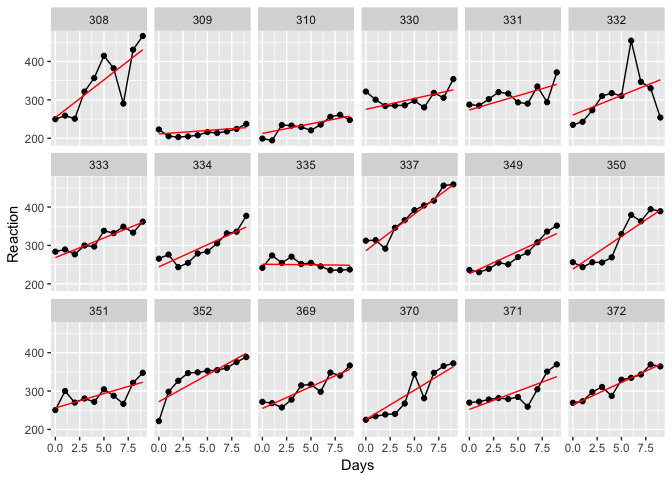<!-- -->

```r
#would be nice to see these against main regression line
ss %>% 
  mutate(yhat = predict(lmm2),
         yhatT = predict(lmm2, re.form = ~0)) %>%
  ggplot(aes(x=Days)) +
  facet_wrap(~ Subject, ncol=6) + 
  geom_point(aes(y=Reaction)) + 
  geom_line(aes(y=Reaction)) +
  geom_line(aes(y=yhat), color='red') +
  geom_line(aes(y = yhatT))
```

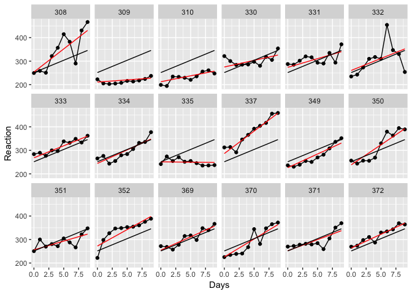<!-- -->

Check out whether there is a difference between the two models. Because one is nested within the other, we can use the likelihood ratio test

```r
anova(lmm1, lmm2)
```

```
## refitting model(s) with ML (instead of REML)
```

```
## Data: ss
## Models:
## lmm1: Reaction ~ Days + (1 | Subject)
## lmm2: Reaction ~ Days + (Days | Subject)
##      Df    AIC    BIC  logLik deviance  Chisq Chi Df Pr(>Chisq)    
## lmm1  4 1802.1 1814.8 -897.04   1794.1                             
## lmm2  6 1763.9 1783.1 -875.97   1751.9 42.139      2  7.072e-10 ***
## ---
## Signif. codes:  0 '***' 0.001 '**' 0.01 '*' 0.05 '.' 0.1 ' ' 1
```
Random slope and intercept fit the data better than just a random intercept.

** NOTE ** We did not have time to examine the model diagnostics. This is absolutely critical prior to deciding that you have modelled the data well.
