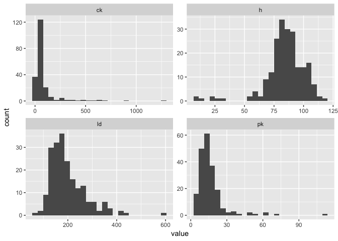
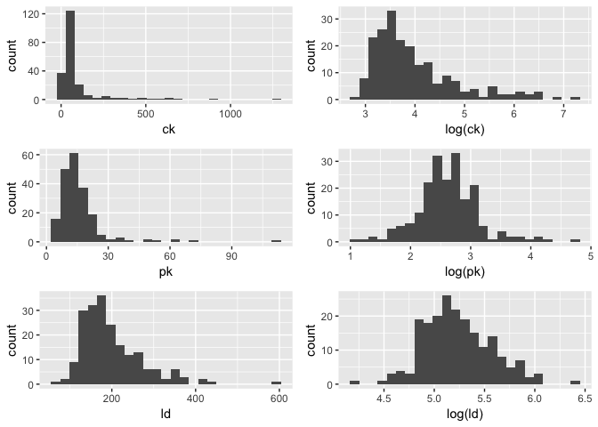
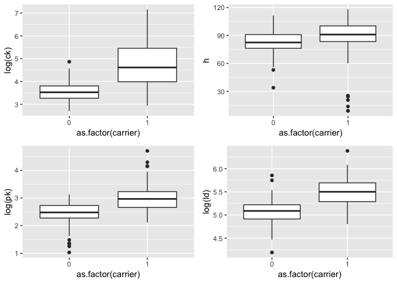

(_Refer back to the Regression lesson if needed)._

## Key Concepts

> 
- Linear model with continuous X
- Interpretation of model output
- Multiple regression and model selection
- Logistic regression
- Mixed effects models

## Muscular Dystrophy Genetics

The questions that follow are based on data collected to examine several blood serum markers believed to be associated with genetics for a specific kind of muscular dystrophy (DMD). The data were analyzed and results reported in a [1985 paper](https://www.ncbi.nlm.nih.gov/pubmed/7137219). In particular, the authors were interested in whether a woman's DMD carrier status (`carrier`) was related to blood serum markers: creatine kinase (`ck`), hemopexin (`h`), pyruvate kinase (`pk`) and lactate dehydrogenase (`ld`). 

For more information on the data set see: 

http://biostat.mc.vanderbilt.edu/wiki/pub/Main/DataSets/dmd.html

Load the tidyverse library and then download and read in the dmd.csv data.


## 1. What is the average value for lactate dehydrogenase?


```
## [1] 198.5891
```

## 2. The four serum markers (creatine kinase, hemopexin, pyruvate kinase and lactate dehydrogenase) are all predictors of interest in this case. Use **ggplot2** to create histograms to assess the normality of the distribution for each of these variables.

**HINT**: The plot below uses `gather()` from **tidyr** to transform the data so all histograms can be rendered in a single "facet wrapped" plot. Feel free to give this a shot or create separate histograms for each variable. Either method is acceptable.

<!-- -->

## 3. All of these columns have outliers and are (at least slightly) skewed. Try using a natural log transformation (`log()`) and create another histogram showing the transformed data. Which variables benefit from the log transformation?

**HINT**: The plot below uses `grid.arrange()` from the **grideExtra** package to plot the raw distribution side-by-side with their transformed version. Feel free to give this a shot or create separate histograms for each variable. Either method is acceptable.

<!-- -->

## 4. Create boxplots showing the carrier status on the x and the transformed blood serum marker on the y for each of the 4 blood serum markers. Which marker seems to be the best predictor of carrier status?
<!-- -->

## 5. Even when transformed, the distributions of the blood serum markers are a little skewed. Assuming we can tolerate this, let's try fitting a binary logistic regression model that predicts the mother's status as carrier based on the values of the four blood serum markers. Don't forget to use the log version(s) of the markers, and to use `summary()` on the model object to view the coefficients.


```
## 
## Call:
## glm(formula = carrier ~ log(ck) + h + log(pk) + log(ld), family = "binomial", 
##     data = dmd)
## 
## Deviance Residuals: 
##     Min       1Q   Median       3Q      Max  
## -2.2021  -0.4203  -0.1443   0.1021   2.3616  
## 
## Coefficients:
##              Estimate Std. Error z value Pr(>|z|)    
## (Intercept) -39.61938    6.61738  -5.987 2.14e-09 ***
## log(ck)       2.75201    0.63947   4.304 1.68e-05 ***
## h             0.11061    0.02808   3.939 8.18e-05 ***
## log(pk)       1.58179    0.72300   2.188   0.0287 *  
## log(ld)       2.69969    1.10369   2.446   0.0144 *  
## ---
## Signif. codes:  0 '***' 0.001 '**' 0.01 '*' 0.05 '.' 0.1 ' ' 1
## 
## (Dispersion parameter for binomial family taken to be 1)
## 
##     Null deviance: 250.08  on 193  degrees of freedom
## Residual deviance: 100.15  on 189  degrees of freedom
##   (15 observations deleted due to missingness)
## AIC: 110.15
## 
## Number of Fisher Scoring iterations: 7
```

## 6. The coefficient (estimate) for each explanatory variable gives us the log of the odds ratio. Exponentiate the estimates to make them more interpretable (i.e. the odds ratio for each 1-unit increase in the predictor variable).


```
## (Intercept)     log(ck)           h     log(pk)     log(ld) 
##      0.0000     15.6741      1.1170      4.8636     14.8752
```

## 7. Interpret the output from above.
